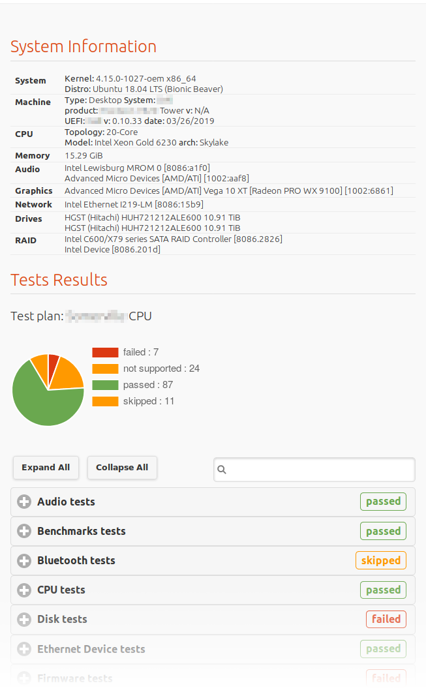
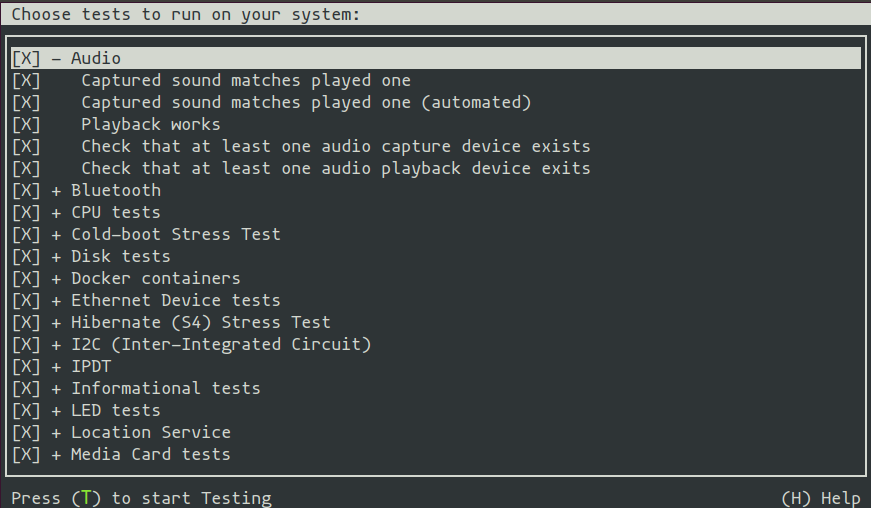

# What is Checkbox?

[Checkbox] is a testing framework used to validate device compatibility with Ubuntu Linux. It’s the testing tool developed for the purposes of the [Ubuntu Certification program].

You can use Checkbox to check if your system is behaving correctly, or you can develop your own set of tests to check your needs.

Checkbox generates test reports in different formats (HTML, JSON, JUnit, plain text) that can be used to easily share the results of a test session.

For more information, check the [documentation](https://checkbox.readthedocs.io) ([installation instructions]).





# Getting started

To get started with Checkbox, follow the [Checkbox tutorial](https://checkbox.readthedocs.io/en/latest/tutorial/index.html) ([installation instructions]).

Check the [contributing guide] to learn how to:

- setup a test environment
- run Checkbox and its providers
- run the associated tests
- share your contributions with everyone.

# Content of this repository

[Checkbox] is composed of a number of parts:

- `checkbox-core-snap`: snapcraft recipe to build the Checkbox core snap which contains the Checkbox runtime and the public providers (i.e. the `checkbox[16|18|20|22]` snaps in the Snap store)
- `checkbox-ng`: the core application
- `checkbox-snap`: snapcraft recipe to build the Checkbox test runner (i.e. the `checkbox` snap in the Snap store)
- `checkbox-support`: Python scripts and helper modules (for instance information parsers for different Linux utilities) used by Checkbox and its providers
- `metabox`: application to help test and validate Checkbox in different configurations using Linux containers or virtual machines
- `providers`: the main [providers] (`base`[^1], `resource`) along with other public providers[^2]:

  ```bash
  └── providers
      ├── base
      ├── certification-client
      ├── certification-server
      ├── docker
      ├── gpgpu
      ├── iiotg
      ├── resource
      ├── sru
      └── tpm2
  ```

[Checkbox]: https://checkbox.readthedocs.io
[documentation]: https://checkbox.readthedocs.io
[installation instructions]: https://checkbox.readthedocs.io/en/latest/tutorial/using-checkbox/installing-checkbox.html
[contributing guide]: CONTRIBUTING.md
[providers]: https://checkbox.readthedocs.io/en/latest/understanding.html#provider
[Ubuntu Certification program]: https://ubuntu.com/certified
[^1]: formerly known as "Checkbox provider" or `plainbox-provider-checkbox`
[^2]: providers hosted elsewhere (e.g. providers specific to private projects).
