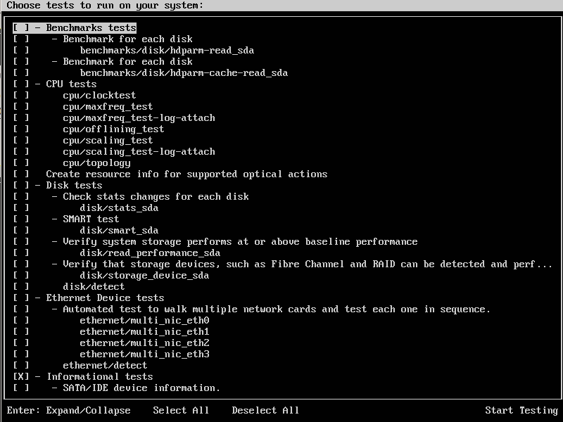

Introduction to PlainBox
========================

.. contents::

What is PlainBox?
-----------------

Many years ago, a dark sorcerer known only as CR3 created a testing tool
called ``hw-test`` with the vision of running tests against hardware to
bless the hardware and deem it as Ubuntu Certified.  There was great
rejoicing.  From the crowd that gathered around this tool came requests and
requirements for new features, new tests and new methods of doing things. 
Over the subsequent years, a tool called CheckBox was created. It was the
product of the design by committee philosophy and soon grew ponderous and
difficult to understand except by a few known only as "The Developers."
CheckBox's goal was to function as a universal testing engine that could
drive several types of testing: end-users running tests on their systems,
certification testing with a larger set of tests, and even OEM-specific
testing with custom tests.

A couple of years ago CheckBox started showing its age. The architecture
was difficult to understand and to extend and the core didn't really scale
to some things we wanted to do; however, the test suite itself was still
quite valuable.

Thus PlainBox was created, as a "plain CheckBox" and again, there was much
rejoicing. It was originally meant to be a simpler library for creating
testing applications and as a requirement, it was designed to be compatible
with the CheckBox test/job definition format.

Since then, PlainBox has become a large set of libraries and tools, but the
central aim is still to write testing applications. Note that the term
*CheckBox* is still used to refer to the test suite generically; *PlainBox*
is used to refer to the new tool set "under the hood."

Goal
----

The goal of these tools is of course to run tests. They use a test
description language that was inherited from CheckBox, so it has many
interesting quirks. Since CheckBox itself is now deprecated, we have been
adding new features and improving the test description language so this is
in some flux.

Terminology
-----------

In developing or using PlainBox, you'll run into several unfamiliar terms. Check the :doc:`../glossary` to learn what they mean. In fact, you should probably check it now. Pay particular attention to the terms *CheckBox*, *PlainBox*, *job*, *provier*, and *whitelist*.

Getting Started
---------------

To get started, we'll install PlainBox and ``checkbox-ng`` along with some
tests and look at how they are organized and packaged.

The newest versions are in our PPAs. We'll use the development PPA at
``ppa:checkbox-dev/ppa``. From there we'll install ``plainbox``,
``checkbox-ng``, and ``plainbox-provider-checkbox``.

As an end user this is all I need to run some tests. We can quickly run
``checkbox-cli``, which will show a series of screens to facilitate running tests. First up is a welcome screen:

.. image:: cc1.png
 :height: 178
 :width: 800
 :scale: 100
 :alt: checkbox-cli presents an introductory message before enabling you to select tests.

When you press the Enter key, ``checkbox-cli`` lets you select which whitelist to use:

.. image:: cc2.png
 :height: 343
 :width: 300
 :scale: 100
 :alt: checkbox-cli enables you to select which test suite to run.
 
With a whitelist selected, you can choose the individual tests to run:



When the tests are run, the results are saved to files and the program prompts to submit them to Launchpad.

As mentioned, ``checkbox-cli`` is just a convenient front-end for some
PlainBox features but it lets us see some aspects of PlainBox.

Looking Deeper
--------------

Providers
`````````

First, we installed some "provider" packages. Providers were designed to
encapsulate test descriptions and their related tools and data. Providers
are shipped in Debian packages, which allows us to express dependencies to
ensure required external packages are installed, and we can also separate
those dependencies; for instance, the provider used for server testing
doesn't actually contain the server-specific test definitions (we try to
keep all the test definitions in the CheckBox provider), but it does depend
on all the packages needed for server testing. Most users will want the
resource and CheckBox providers which contain many premade tests, but this
organization allows shipping the tiny core and a fully customized provider
without extraneous dependencies.

A provider is described in a configuration file (stored in
``/usr/share/plainbox-providers-1``). This file describes where to find all
the files from the provider. This file is usually managed automatically
(more on this later) but to see how it's structured, consider the
``/usr/share/plainbox-providers-1/2013.com.canonical.certification.checkbox.provider``
file::

 [PlainBox Provider]
 bin_dir = /usr/lib/2013.com.canonical.certification:checkbox/bin
 data_dir = /usr/share/2013.com.canonical.certification:checkbox/data
 description = Checkbox provider
 gettext_domain = 2013.com.canonical.certification.checkbox
 jobs_dir = /usr/share/2013.com.canonical.certification:checkbox/jobs
 locale_dir = /usr/share/locale
 name = 2013.com.canonical.certification:checkbox
 version = 0.5
 whitelists_dir = /usr/share/2013.com.canonical.certification:checkbox/whitelists

You can see a provider can ship jobs, binaries, data and whitelists.

A **job** or **test** is the smallest unit or description that PlainBox knows about. It describes a single test (historically they're called jobs). 
The simplest possible job is::

 id: a-job 
 plugin: manual 
 description: Ensure your computer is turned on. Is the computer turned on?

Jobs are shipped in a provider's jobs directory. This ultra-simple example has three fields: ``id``, ``plugin``, and ``description``. The ``id`` identifies the job (of course) and the ``description`` provides a plain-text description of the job. In the case of this example, the description is shown to the user, who must respond because the ``plugin`` type is ``manual``. ``plugin`` types include (but are not limited to):

 * ``manual`` -- A test that requires the user to perform some action and report the results.
 * ``shell`` -- An automated test that requires no user interaction; the test is passed or failed on the basis of the return value of the script or command.
 * ``local`` -- This type of job is similar to a ``shell`` test, but it supports creating multiple tests from a single definition (say, to test all the Ethernet ports on a computer). Jobs using the ``local`` plugin are run when PlainBox is initialized.
 * ``user-interact`` -- A test that asks the user to perform some action *before* the test is performed. The test then passes or fails automatically based on the output of the test. An example is ``keys/media-control``, which runs a tool to detect keypresses, asks the user to press volume keys, and then exits automatically once the last key has been pressed or the user clicks the skip button in the tool.
 * ``user-interact-verify`` -- This type of test is similar to the ``user-interact`` test, except that the test's output is displayed for the user, who must then decide whether it has passed or failed. An example of this would be the ``usb/disk_detect`` test, which asks the user to insert a USB key, click the ``test`` button, and then verify manually that the USB key was detected correctly.
 * ``user-verify`` -- A test that the user manually performs or runs automatically and requires the user to verify the result as passed or failed.  An example of this is the graphics maximum resolution test which probes the system to determine the maximum supported resolution and then asks the user to confirm that the resolution is correct.

A fairly complex example definition is::

 plugin: local
 _summary: Automated test to walk multiple network cards and test each one in sequence.
 id: ethernet/multi_nic
 requires:
  device.category == 'NETWORK'
 _description: Automated test to walk multiple network cards and test each one in sequence.
 command:
  cat <<'EOF' | run_templates -s 'udev_resource | filter_templates -w "category=NETWORK" | awk "/path: / { print \$2 }" | xargs -n 1 sh -c "for i in \``ls /sys\$0/net 2>/dev/null\``; do echo \$0 \$i; done"'
  plugin: shell
  id: ethernet/multi_nic_$2
  requires:
   package.name == 'ethtool'
   package.name == 'nmap'
   device.path == "$1"
  user: root
  environ: TEST_TARGET_FTP TEST_TARGET_IPERF TEST_USER TEST_PASS
  command: network test -i $2 -t iperf --fail-threshold 80
  estimated_duration: 330.0
  description:
   Testing for NIC $2
  EOF

Key points to note include:

 * If a field name begins with an underscore, its value can be localized.
 * The values of fields can appear on the same line as their field names, as in ``plugin: local``; or they can appear on a subsequent line, which is indented, as in the preceding example's ``requires: device.category == 'NETWORK'``.
 * The ``requires`` field can be used to specify dependencies; if the specified condition is not met, the test does not run.
 * The ``command`` field specifies the command that's used to run the test. This can be a standard Linux command (or even a set of commands) or a CheckBox test script. In this example's ``local`` test definition, the first ``command`` line generates a list of network devices that is fed to an embedded test, which is defined beginning with the second ``plugin`` line immediately following the first ``command`` line.
 * In this example, the line that reads ``EOF`` ends the ``ethernet/ethtool_multi_nic_$2`` test's command; it's matched to the ``EOF`` that's part of ``cat << 'EOF'`` near the start of that command.

Each provider has a ``bin`` directory and all binaries there are available in the
path.

Whitelists
``````````

In the job files we have a "universe" of known jobs. We don't normally want
to run them all; rather we want to select a subset depending on what we're
testing, and maybe give the user a way to fine-tune that selection. Also,
we need a way to determine the order in which they will run, beyond what
dependencies may provide. This is where the whitelist comes in; think of it
as a mask or selection filter from the universe of jobs. Whitelists support
regular expressions, and PlainBox will attempt to run tests in the order
shown in the whitelist. Again, providers ship whitelists in a specific
directory, and you can use ``plainbox`` to run a specific whitelist with
the ``-w`` option.

You can also use ``plainbox`` to run a test with the ``-i`` syntax. This is
good for quickly running a job and ensuring it works well.

Let's look at ``checkbox-cli`` for a moment. This is a "launcher"; it
specifies a set of configuration options for a specific testing purpose.
This enables us to create mini-clients for each testing purpose, without
changing the core utility (``checkbox-launcher``). For instance, let's look
at the launcher for ``canonical-certification-server``, which appears in
``./providers/plainbox-provider-certification-server/launcher/canonical-certification-server``
in the CheckBox source tree::

 #!/usr/bin/env checkbox-launcher
 [welcome]
 text = Welcome to System Certification!
     This application will gather information from your system. Then you will be
     asked manual tests to confirm that the system is working properly. Finally,
     you will be asked for the Secure ID of the computer to submit the
     information to the certification.canonical.com database.
     To learn how to create or locate the Secure ID, please see here:
     https://certification.canonical.com/

 [suite]
 # Whitelist(s) displayed in the suite selection screen
 whitelist_filter = ^((network|storage|usb|virtualization)-only)|(server-(full|functional)-14.04)$
 # Whitelist(s) pre-selected in the suite selection screen, default whitelist(s)
 whitelist_selection = ^server-full-14.04$

 [transport]
 submit_to = certification

 [config]
 config_filename = canonical-certification.conf

A launcher such as this sets up an environment that includes introductory
text to be shown to users, a filter to determine what whitelists to present
as options, information on where to (optionally) submit results, and a
configuration filename. This allows each provider to ship a launcher or
binary with which to launch its relevant tests.

Developing Tests
````````````````

One way to deliver tests via PlainBox is to start your own provider. To learn how to do that, see the :ref:`tutorial`.

In other cases you want to add tests to the main CheckBox repository (which
is also what we recommend to keep tests centralized, unless they're so
purpose-specific that this makes no sense).

This is a bit easier because the provider in question already exists. So
let's get started by branching a copy of ``lp:checkbox``. In brief, you
should change to your software development directory and type ``bzr branch
lp:checkbox my-branch`` to create a copy of the ``checkbox`` Launchpad
project in the ``my-branch`` subdirectory. You can then edit the files in
that subdirectory, upload the results to your own Launchpad account, and
request a merge.

To begin, consider the files and subdirectories in the main CheckBox
development directory (``my-branch`` if you used the preceding ``bzr``
command without change):

 * ``checkbox-gui`` -- CheckBox GUI components, used in desktop/laptop testing
 * ``checkbox-ng`` -- The PlainBox-based version of CheckBox
 * ``checkbox-support`` -- Support code for many providers
 * ``checkbox-touch`` -- A CheckBox frontend optimized for touch/tablet devices
 * ``mk-venv`` -- A symbolic link to a script used to set up an environment for testing CheckBox
 * ``plainbox`` -- A Python3 library and development tools at the heart of PlainBox
 * ``plainbox-client`` -- Unfinished Python3 interface for CheckBox
 * ``providers`` -- Provider definitions, including test scripts
 * ``README.md`` -- A file describing the contents of the subdirectory in greater detail
 * ``setup.py`` -- A setup script
 * ``support`` -- Support code that's not released
 * ``tarmac-verify`` -- A support script
 * ``test-in-lxc.sh`` -- A support script for testing in an LXC
 * ``test-in-vagrant.sh`` -- A support script for testing with Vagrant
 * ``test-with-coverage`` -- A link to a support script for testing with coverage
 * ``Vagrantfile`` -- A Vagrant configuration file

Let's say I want to write a test to ensure that the ubuntu user exists in
``/etc/passwd``. You need to remove any existing CheckBox provider
packages, lest they interfere with your new or modified tests. The
``setup.py`` script will set up a PlainBox development environment for you.

We can write a simple job here, then add a requirement, perhaps a
dependency, then a script in the directory. Note that scripts can be
anything that's executable, we usually prefer either shell or Python but
anything goes.

PlainBox will supply two environment variables, ``PLAINBOX_PROVIDER_DATA``
and ``SHARE``, we usually try to use them in the job description only, not
in the scripts, to keep the scripts PlainBox-agnostic if possible.

Once the test is running correctly, we can create a whitelist with a few tests
and name it.

Once we get everything running correctly we can prepare and propose a merge
request using ``bzr`` as usual.

Other Questions
---------------

 **What Python modules are useful?**
  I usually Google for the description of the problem I'm trying to solve, and/or peruse the Python documentation in my spare time. I recommend the *Dive Into Python* books if you have experience with another language, as they are very focused on how to translate what you know into Python. This applies also to Pythonisms like iterators, comprehensions, and dictionaries which are quite versatile, and others. Again, the *Dive* books will show you how these work.

 **Are there other tools to use?**
  ``flake8`` or ``pyflakes``, it's always a good idea to run this  if you
  wrote a Python script, to ensure consistent syntax. ``manage.py
  validate`` and ``plainbox dev analyze`` are also good tools to know
  about.

 **Is there a preferred editor for Python programming?**
  I don't really know of a good editor/IDE that will provide a lot of help when developing Python, as I usually prefer a minimalistic editor. I'm partial to ``vim`` as it has syntax coloring, decent formatting assistance, can interface with ``git`` and ``pyflakes`` and is just really fast. We even have a plugin for PlainBox job files. Another good option if you're not married to an editor is sublime text, Zygmunt has been happy with it and it seems easy to extend, plus it's very nice-looking. A recent survey identified Kate as a good alterntive. The same survey identified ``gedit`` as *not* a good alternative so I'd avoid that one. Finally if you're into cloud, ``cloud9.io`` may be an option although we don't have a specific PlainBox development setup for it.

References
----------

 :doc:`Reference on PlainBox test authoring <index>`

 :doc:`jobs`

 :doc:`PlainBox provider template <provider-template>`

 :doc:`Provider and job writing tutorial <tutorial>`

 :doc:`../dev/intro`

 :doc:`What resources are and how they work <../dev/resources>`

 :doc:`Man pages on special variables available to jobs <../manpages/PLAINBOX_SESSION_SHARE>`
  
 :doc:`All the manpages <../manpages/index>`

 `The CheckBox stack diagram`_

.. _The CheckBox stack diagram: http://checkbox.readthedocs.org/en/latest/stack.html

 `Old CheckBox documentation for nostalgia`_

.. _Old CheckBox documentation for nostalgia: https://wiki.ubuntu.com/Testing/Automation/CheckBox

 `Usual Python modules`_

.. _Usual Python modules: https://docs.python.org/3.3/

 `Document on upcoming template units feature`_

.. _Document on upcoming template units feature: http://bazaar.launchpad.net/~checkbox-dev/checkbox/trunk/view/head:/plainbox/docs/manpages/plainbox-template-units.rst

 `A quick introduction to Bazaar and bzr`_

.. _A quick introduction to Bazaar and bzr: http://doc.bazaar.canonical.com/bzr.dev/en/mini-tutorial/

 `A tool to use git locally but be able to pull/push from Launchpad`_

.. _A tool to use git locally but be able to pull/push from Launchpad: http://zyga.github.io/git-lp/

 `A video on using git with Launchpad`_

.. _A video on using git with Launchpad: https://plus.google.com/115602646184989903283/posts/RCepekrA5gu

 `A video on how to set up Sublime Text for PlainBox development`_

.. _A video on how to set up Sublime Text for PlainBox development: https://www.youtube.com/watch?v=mrfyAgDg4ME&list=UURGrmUhQo5P9hTbVskIIjoQ

 `CheckBox(ng) documentation home`_

.. _CheckBox(ng) documentation home: http://checkbox.readthedocs.org
