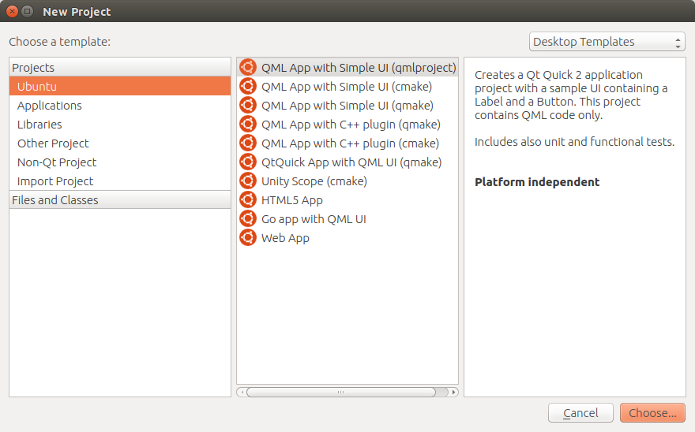

========================
QML-native Jobs Tutorial
========================

.. contents::

What is a qml-native job
------------------------

A qml-native job is a simple Qt Quick application (it usually is one .qml file)
designed to test computer systems as any other plainbox job, difference being
that it can have fully blown GUI and communicates with checkbox stack using
predefined interface.

Software requirements
---------------------

To develop and run qml-native jobs you need two things:

Ubuntu-SDK and Plainbox

Ubuntu-SDK installation
```````````````````````

To install Ubuntu-SDK just run

``# apt-get install ubuntu-sdk``

Ubuntu-SDK, once opened, will ask you if you want to create any kit.

.. image:: qml-tut-0.png
 :scale: 100
 :alt: ubuntu-sdk kit creation wizard.

Go ahead and create one matching the architecture you're running on. And grab
a coffee, as this may take awhile. If prompted about emulator installation, skip
the screen.

Plainbox installation
`````````````````````

add checkbox-dev PPA:

``# apt-add-repository ppa:checkbox-dev/ppa``

retrieve the list of packages:

``# apt-get update``

install latest plainbox

``# apt-get install plainbox``

If you want to work on the greatest and latest of Plainbox, you might want to 
use trunk version. To do that follow these steps::

    $ bzr checkout --lightweight lp:checkbox
    $ cd checkbox
    $ ./mk-venv venv
    $ . venv/bin/activate

Now you should be able to launch ``plainbox-qml-shell`` command.

First qml-native job - Smoke test
---------------------------------

Let's build a very basic test that shows pass and fail buttons.  All
qml-native jobs start as ordinary QtQuick ``Item{}``, with ``testingShell``
property and testDone signal. I.e. ::

    import QtQuck 2.0
    Item {
        property var testingShell;
         signal testDone(var test);
    }

That's the boilerplate code every qml-native job will have.
Now let's add two buttons.::

    import QtQuck 2.0
    import Ubuntu.Components 0.1
    Item {
        property var testingShell;
        signal testDone(var test);
        Column {
            Button {
                text: "pass"
                onClicked: testDone({outcome: "pass"})
            }
            Button {
                text: "fail"
                onClicked: testDone({outcome: "fail"})
            }
        }
    }

Save the above code as ``simple-job.qml``. We will run it in a minute.

``{outcome: "pass"}`` - this code creates an object with one property -
``outcome`` that is set the value of ``"pass"``.

``testDone({outcome: "pass"})`` -  triggers ``testDone`` signal sending newly
created object. This informs the governing infrastructure that the test is
done and the test passed.


How to run jobs
---------------

Now we're ready to test newly developed qml job. Run: ::

    $ plainbox-qml-shell simple-job.qml

.. image:: qml-tut-1.png
 :scale: 100
 :alt: ubuntu-sdk kit creation wizard.

It's not the prettiest qml code in the world, but it is a proper qml-native
plainbox job!


Multi-page tests
----------------

Two common approaches when developing multi-page qml app are flat structure, or
page navigation using page stack.

Flat page hierarchy
```````````````````

The simplest way is to create two Page components and switch their visibility
properties.  E.g.::

    Item {
        id: root
        property var testingShell;
        Page {
            id: firstPage
            Button {
                onClicked: {
                    firstPage.visible = false;
                    secondPage.visible = true;
                }
            }
        }
        Page {
            id: secondPage
            visible: false
        }
    }


Using page stack
````````````````

``testingShell`` defines ``pageStack`` property that you can use for multi-page
test with navigation. E.g.::

    Item {
        id: root
        property var testingShell;
        Page {
            id: firstPage
            visible: false
            Button {
                onClicked: testingShell.pageStack.push(second)
            }
        }
        Page {
            id: secondPage
            visible: false
        }
        Component.onCompleted: testingShell.pageStack.push(first)
    }


Migrating QtQuick app to a qml-native test
------------------------------------------

Start by creating ordinary "QML App with Simple UI"



The code generated by SDK should look like this:

.. image:: qml-tut-3.png
 :height: 525
 :width: 840
 :alt: ubuntu-sdk kit creation wizard.

Now you can do a typical iterative process of developing an app that should
have the look and feel of the test you would like to create.

Let's say you're satisfied with the following app::

    import QtQuick 2.0
    import Ubuntu.Components 1.1

    MainView {
        useDeprecatedToolbar: false

        width: units.gu(100)
        height: units.gu(75)

        Page {
            Column {
                spacing: units.gu(1)
                anchors {
                    margins: units.gu(2)
                    fill: parent
                }

                Label {
                    id: label
                    text: i18n.tr("4 x 7 = ?")
                }

                TextField {
                    id: input
                }

                Button {
                    text: i18n.tr("Check")

                    onClicked: {
                        if (input.text == 28) {
                            console.log("Correct!");
                        } else {
                            console.log("Error!");
                        }
                    }
                }
            }
        }
    }


Notice that the app has a ``MainView`` component and one ``Page`` component.
These are not needed in qml-native jobs, as the view is managed by the testing
shell.  Also, the outcome of the app is a simple ``console.log()`` statement.
To convert this app to a proper qml-native job we need to do three things:

 * remove the bits responsible for managing the view
 * add ``testingShell`` property and the ``testDone`` signal
 * call ``testDone`` once we have a result

Final result::

    import QtQuick 2.0
    import Ubuntu.Components 1.1
    Item {
        property var testingShell;
        signal testDone(var test);

        Column {
            spacing: units.gu(1)
            anchors {
                margins: units.gu(2)
                fill: parent
            }

            Label {
                id: label
                text: i18n.tr("4 x 7 = ?")
            }

            TextField {
                id: input
            }

            Button {
                text: i18n.tr("Check")
                onClicked: {
                    if (input.text == 28) {
                        testDone({outcome: "pass"});
                    } else {
                        testDone({outcome: "fail"});
                    }
                }
            }
        }
    }

Plainbox job definition for the test
````````````````````````````````````

The qml file we've created cannot be considered a plainbox job until it is
defined as a unit in a plainbox provider.

Consider this definition::

    id: quazi-captcha
    category_id: Captcha
    plugin: qml
    _summary: Basic math captcha
    _description:
     This test requires user to do simple multiplication
    qml_file: simple.qml
    estimated_duration: 5

Two bits that are different in qml jobs are ``plugin: qml`` and
``qml_file: simple.qml``

``plugin`` field specifies the type of the plainbox job. The value of `qml`
informs checkbox applications that this should be run in QML environment
(testing shell) and ``qml_file`` field specifies which file serves as the entry
point to the job. The file must be located in the ``data`` directory of the
provider the job is defined in.

For other information regarding plainbox job units see:

http://plainbox.readthedocs.org/en/latest/manpages/plainbox-job-units.html

To add this job to the plainbox provider with other qml jobs, paste the job
defintion to:
``checkbox/providers/2015.com.canonical.certification:qml-tests/units/qml-tests.pxu``

Testing qml job in Checkbox Touch on Ubuntu device
``````````````````````````````````````````````````

With job definition in qml-tests provider, and the qml file copied to its data
directory we can build and install checkbox click package.
In ``checkbox/checkbox-touch`` run::

    ./get-libs
    ./build-me ../providers/2015.com.canonical.certification\:qml-tests/ \
    --install

Launch the "Checkbox" app on the device and your test should be live.


