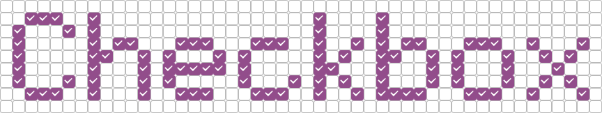

.. Checkbox documentation master file, created by
   sphinx-quickstart on Wed Feb 13 11:18:39 2013.
   You can adapt this file completely to your liking, but it should at least
   contain the root `toctree` directive.

Checkbox is a flexible test automation software.
It's the main tool used in Ubuntu Certification program.

.. image:: _images/checkbox-test-report.png
   :alt: Test report exported in HTML
   :scale: 25%
   :align: right
   :target: _images/checkbox-test-report.png

You can use checkbox without any modification to check if your system is
behaving correctly or you can develop your own set of tests to check your
needs. See :ref:`tutorials` for details.

Checkbox optionally generates test reports in different formats (JSON, HTML,
etc.) that can be used to easily share the results of a test session.

.. figure:: _images/checkbox-snappy-3-select-jobs.png
   :alt: Checkbox test selection screen
   :align: center

   Test selection screen in checkbox

.. _installation:

Installation
^^^^^^^^^^^^

Checkbox can be installed from a :abbr:`PPA (Personal Package Archive)`.

.. code-block:: bash

    $ sudo add-apt-repository ppa:hardware-certification/public
    $ sudo apt-get update
    $ sudo apt-get install checkbox-ng plainbox-provider-resource-generic plainbox-provider-certification-client plainbox-provider-checkbox canonical-certification-client

The ``plainbox-provider-certification-client`` package will pull a lot of
desktop-related packages. If you intend to run tests on a server, run these
commands instead:

.. code-block:: bash

    $ sudo add-apt-repository ppa:hardware-certification/public
    $ sudo apt-get update
    $ sudo apt-get install checkbox-ng plainbox-provider-resource-generic plainbox-provider-certification-server plainbox-provider-checkbox canonical-certification-server

Table of contents
=================

.. toctree::
   :maxdepth: 3

   using.rst
   understanding.rst
   tutorials.rst
   remote.rst
   slave-daemon.rst
   units/index.rst
   bugs.rst
   stack.rst
   launcher-tutorial.rst
   side-loading.rst
   configs.rst
   nested-test-plan.rst
   snappy.rst
   testing-snappy.rst
   custom-app.rst
   contributing.rst
   glossary.rst

Indices and tables
==================

* :ref:`genindex`
* :ref:`modindex`
* :ref:`search`
