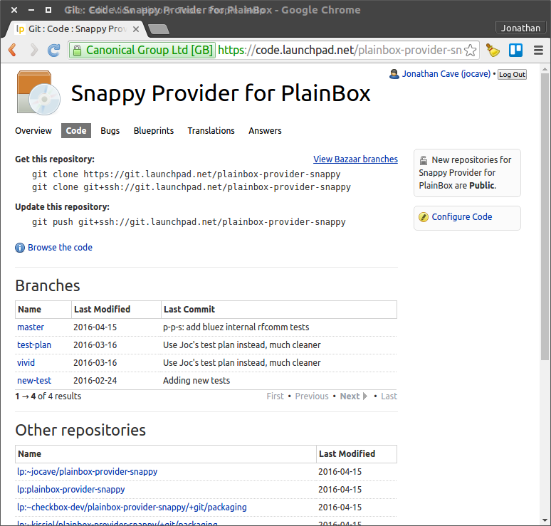
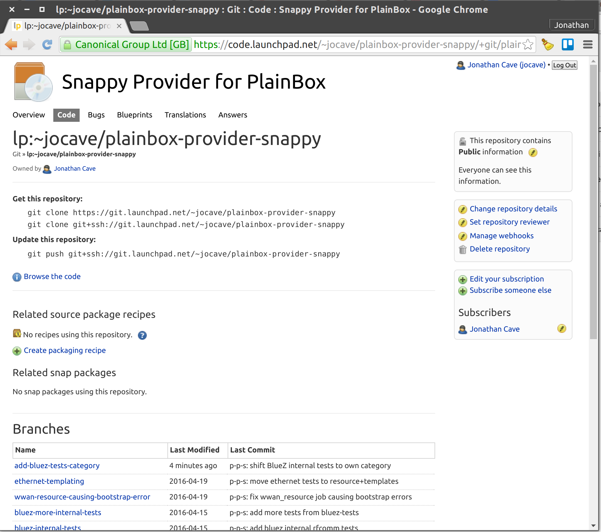
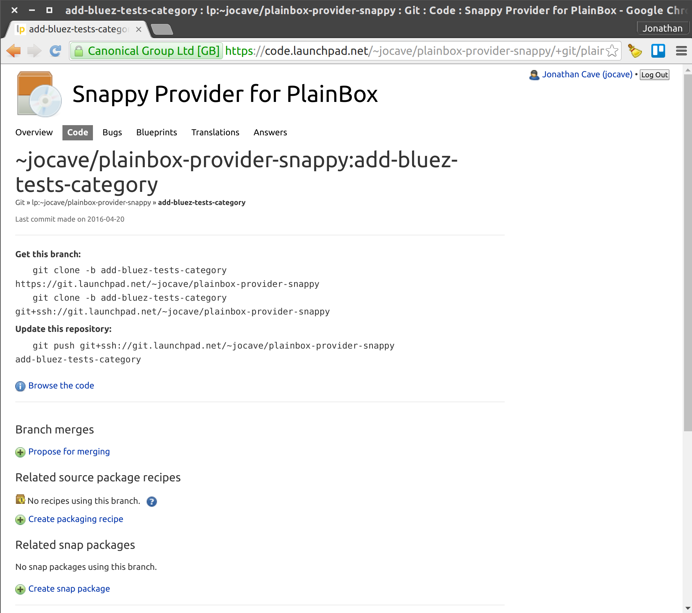
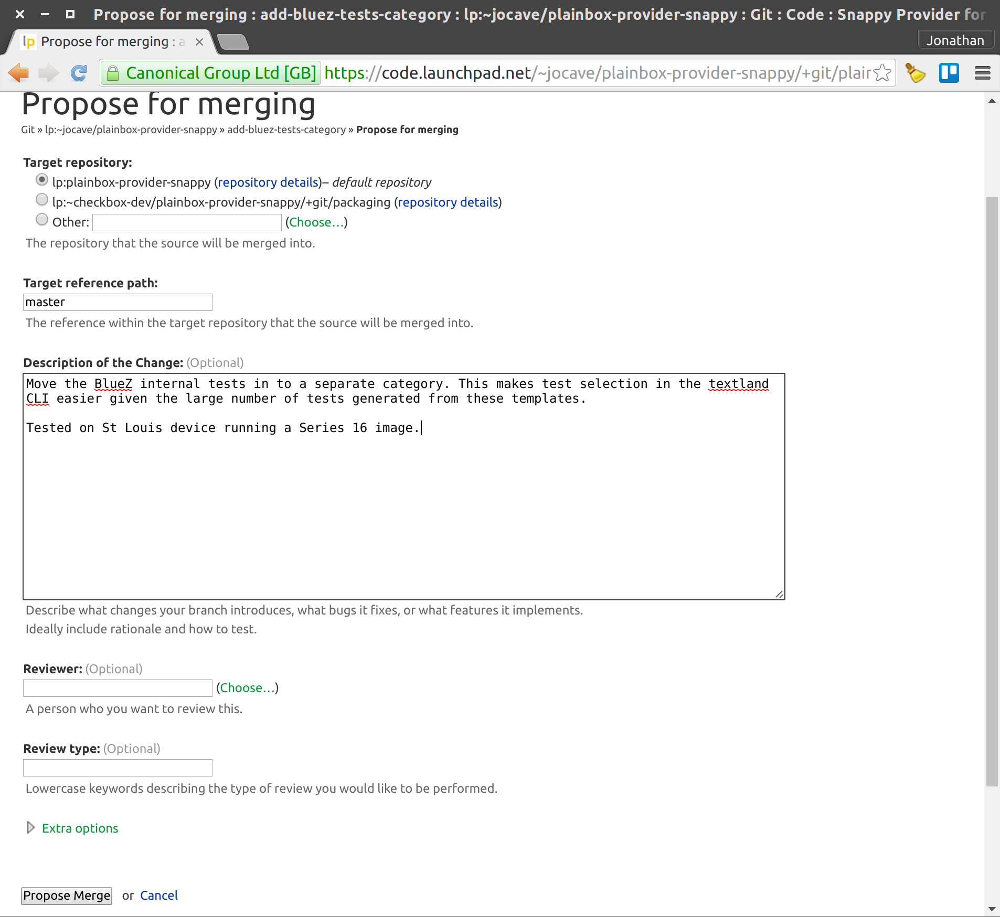

Contributing to Snappy Testing with Checkbox
============================================

Introduction
------------

To support the release of devices running snappy Ubuntu Core, Canonical has
produced versions of Checkbox tailored specifically for these systems.

This document aims to provide the reader with enough information to contribute
new tests, or modify existing tests, with the goal of increasing coverage
wherever possible.

Brief anatomy of a Checkbox test tool
`````````````````````````````````````

Checkbox test tools consist of a number of components falling into three categories:

    * Core testing framework (known as Plainbox)
    * UI and launchers
    * Test definitions and associated data contained in a “Provider”

To add tests one need only know the specifics of the Provider(s) that form
their test tool. The rest of this document will focus on Checkbox Providers and
how to work on them.

Snappy Provider
---------------

The Provider housing the majority of tests for snappy Ubuntu Core systems is
known as plainbox-provider-snappy and can be found in this launchpad project:
https://launchpad.net/plainbox-provider-snappy

All the code both for the core of Checkbox itself and for the tests is also
hosted on Launchpad. Refer to the instructions on the Code subpage to retrieve
the source files for the provider:
https://code.launchpad.net/plainbox-provider-snappy

Directory structure of the Provider
```````````````````````````````````
Using git to clone the provider, described above, will result in a directory
that looks like this (at time of writing)::

    checkbox@xenial:~$ ls -1 plainbox-provider-snappy/
    plainbox-provider-snappy
    plainbox-provider-snappy-resource

The first directory listed is the provider holding the tests, the second is a
supporting provider which gathers information about the system at the start of
a test run. Lets look in more detail at the test provider::

    checkbox@xenial:~$ ls -1 plainbox-provider-snappy/plainbox-provider-snappy
    bin
    data
    manage.py
    po
    src
    units

+-----------+-----------------------------------------------------------------+
| bin       | Executable scripts that can be called as part of the test       |
|           | (refer to command field below)                                  |
+-----------+-----------------------------------------------------------------+
| data      | Data to support the running of tests e.g. configuration files   |
+-----------+-----------------------------------------------------------------+
| manage.py | Provider management script. Must be present in each provider to |
|           | specify unique identifiers.                                     |
+-----------+-----------------------------------------------------------------+
| po        | Translation support, files here are used to provide translations|
|           | for tests fields into other languages.                          |
+-----------+-----------------------------------------------------------------+
| src       | Source files and accompanying build scripts e.g. C source code  |
|           | and a Makefile, that are compiled into binaries and packaged    |
|           | with the provider for use as part of the test (refer to command |
|           | field below)                                                    |
+-----------+-----------------------------------------------------------------+
| units     | “Job” definition files                                          |
+-----------+-----------------------------------------------------------------+

Jobs
````

A Job is Checkbox parlance for an individual test. They are defined in text
files whose syntax is loosely based on RFC 822. Here is an example from
plainbox-provider-snappy::

    id: cpu/offlining_test
    _summary:
     Test offlining of each CPU core
    _description:
     Attempts to offline each core in a multicore system.
    plugin: shell
    command: cpu_offlining
    category_id: cpu
    estimated_duration: 1s
    user: root


An overview of the fields in this example test:

+-----------+-----------------------------------------------------------------+
| id        | A unique identifier for the job                                 |
+-----------+-----------------------------------------------------------------+
| summary   | A human readable name for the job. It must be one line long,    |
|           | ideally it should be short (50-70 characters max)               |
+-----------+-----------------------------------------------------------------+
| plugin    | Best thought of as describing the “type” of job.                |
|           | Note that it is preferred for jobs to automated wherever        |
|           | possible so as to minimize both time to complete and possibility|
|           | for operator error. The key job types starting with the most    |
|           | automated are:                                                  |
|           |                                                                 |
|           | * shell - Run the command field and use the return value to     |
|           |   determine the test result                                     |
|           |                                                                 |
|           | * user-interact - Ask the user to perform an action and then run|
|           |   the command field and use the return value to determine the   |
|           |   test result                                                   |
|           |                                                                 |
|           | * user-interact-verify - Ask the user to perform an action, then|
|           |   run the command field, and then ask the user to determine the |
|           |   test result e.g. by examining the command output or observing |
|           |   some physical behaviour                                       |
|           |                                                                 |
|           | * manual - The last resort, just asks the user to both carry out|
|           |   some action(s) and then determine the test result             |
+-----------+-----------------------------------------------------------------+
| command   | A command or script to run as part of the test. A multi-line    |
|           | command or shell script can be used. Refer to the plugin field  |
|           | above for significance to the test outcome.                     |
+-----------+-----------------------------------------------------------------+
| category\ | Groups tests together for convenience in UIs etc.               |
| _id       |                                                                 |
+-----------+-----------------------------------------------------------------+
| estimated\| An estimate of the time taken to execute the job. Uses hours(h),|
| _duration | minutes(m) and seconds(s) format e.g. 1h 23m 4s                 |
+-----------+-----------------------------------------------------------------+

Further reading:
http://checkbox.readthedocs.io/en/latest/units/job.html

Test plans
``````````

Test Plans are a facility for describing a sequence of Job definitions that
should be executed together. Jobs definitions are selected for inclusion in a
Test Plan by either listing their identifier (see id: field above) or by
inclusion of a regular expression that matches their identifier.

Here is an example of a Test Plan from plainbox-provider-snappy, it has been
abbreviated::

    id: snappy-generic
    unit: test plan
    _name: QA tests for Snappy Ubuntu Core devices
    estimated_duration: 1h
    include:
     wifi/.*
     audio/.*


+-----------+-----------------------------------------------------------------+
| id        | A unique identifier for the test plan                           |
|           |                                                                 |
+-----------+-----------------------------------------------------------------+
| unit      | Distinguishes this definition from that of e.g. a test          |
+-----------+-----------------------------------------------------------------+
| _name     | A human readable name for the test plan                         |
+-----------+-----------------------------------------------------------------+
| estimated\| An estimate of the time taken to execute the test plan.         |
| _duration | Uses hours(h), minutes(m) and seconds(s) format e.g. 1h 23m 4s  |
+-----------+-----------------------------------------------------------------+
| include   | The list of tests that make up the test plan. It can be         |
| _id       | multi-line and include individual job identifiers or patterns   |
|           | matching multiple identifiers                                   |
+-----------+-----------------------------------------------------------------+

Further reading:
http://checkbox.readthedocs.io/en/latest/units/test-plan.html


Creating a test in five easy steps
----------------------------------

1. Configure your development environment
`````````````````````````````````````````

Development of Checkbox tests is best carried out on an Ubuntu Desktop system.
You will need either a dedicated PC or Virtual Machine running Ubuntu Desktop
16.04 (Xenial Xerus) to gain access to the tools supporting the building of
packages for snappy Ubuntu Core.

When your system is up and running make sure the following packages are
installed::

    $ sudo apt install snapcraft git:


And to ease development, remove these pre-installed providers::

    $ sudo apt remove plainbox-provider-checkbox plainbox-provider-resource-generic

	You should now have all the tools required to modify and build a provider.

2. Get the source
`````````````````

Clone the providers::

    $ git clone https://git.launchpad.net/plainbox-provider-snappy


Clone the snapcraft packaging branch::

    $ git clone https://git.launchpad.net/~checkbox-dev/plainbox-provider-snappy/+git/packaging

Further instructions will assume these were cloned into your user’s home
directory.

3. Make your changes
````````````````````

The units folder contains a number of files named after categories. This is not
a requirement, but has been used here to make finding tests a bit easier.
Either create a new file or edit an existing category.::

    $ git checkout -b <NEW-BRANCH>
    $ touch ~/plainbox-provider-snappy/plainbox-provider-snappy/units/<category>.pxu
    $ editor ~/plainbox-provider-snappy/plainbox-provider-snappy/units/<category>.pxu

If adding a new test, make sure to add the test id to the “includes” section of
any test plans you’d like this test to be part of.

4. Check your test is valid
```````````````````````````

Use the provider management script to check the provider is still valid after
your modifications::

    $ cd ~/plainbox-provider-snappy/plainbox-provider-snappy-resource
    $ ./manage.py develop
    $ cd ~/plainbox-provider-snappy/plainbox-provider-snappy
    $ ./manage.py validate

The validate tool will provide advisories to indicate places where your provider
does not follow best practices, warnings to indicate places where runtime
issues could arise, and errors to indicate things which must be fixed for the
provider to be parsed and run correctly by Checkbox. This validation result is
given in the last line::

    The provider seems to be valid

5. Build the Checkbox snap package
``````````````````````````````````

The tools to build a new version of the Checkbox tool snap package are found in
your clone of the packaging branch. This uses the snapcraft tool which is
controlled by the snapcraft.yaml file. To build a snap with your local changes
examine this file for the source sections of the provider parts::

    $ editor ~/packaging/snapcraft.yaml

    ...
        plainbox-provider-snappy:
            after: [checkbox]
    ...


Modify these so they point to your local providers:[a][b]::

    ...
        plainbox-provider-snappy:
            source: <path-to-local-provider>
            source-type: local
            after: [checkbox]
    ...


Then you can build the snap package::

    $ snapcraft clean
    ...
    $ snapcraft
    ...
    Snapped checkbox-snappy_0.10~s16_amd64.snap

6. Run the tests
````````````````

See  :ref:`testing-snappy`
which describes the process of installing and running the snap.

7. Submit your modifications to the project
```````````````````````````````````````````

To push code, report bugs etc. you will require a launchpad account:
https://login.launchpad.net/


Once you have an account you will be able to push code up to Launchpad. You can
then request a merge into the master repository. To get the code to Launchpad
follow these steps::

    $ git add <file>
    $ git commit -m “Adds a test for...”
    $ git remote add my-repo git+ssh://git.launchpad.net/~<USERNAME>/plainbox-provider-snappy
    $ git push my-repo <NEW-BRANCH>

If you navigate to the plainbox-provider-snappy project on launchpad you should
now see your repository listed under the “Other repositories” section. Here you
can see my (jocave) personal repository listed at the top:

|
|



|
|

Clicking on your repository will take you to an overview page listing all your
branches:

|
|



|
|

Click on the branch you have uploaded and there will be an option to “Propose
for merging”.

|
|



|
|

Select this and fill out the form as follows:

|
|



|
|

Members of the team that maintain the project will be alerted to the Merge
Request and will review it for landing.
