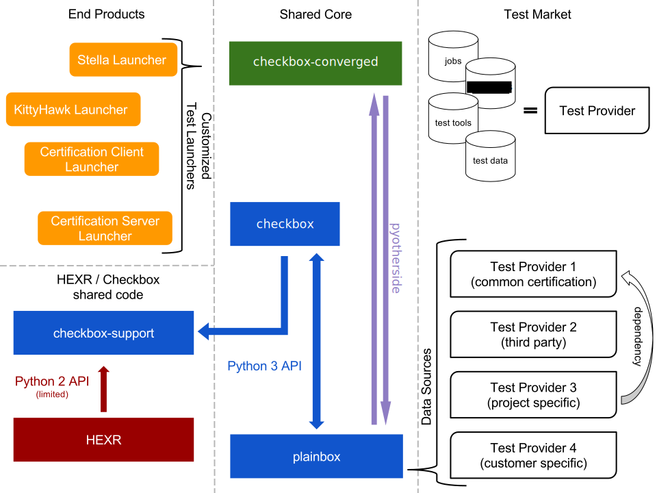

The "Checkbox Stack"
====================

The Checkbox Stack is a collection of projects that together constitute a
complete testing and certification solution. It is composed of the following
parts (see table below for extra details). All of the projects are linked to
from the `Launchpad project group <https://launchpad.net/checkbox-project>`_.

Architecture Diagram
--------------------

This diagram contains a high-level approximation of the current Checkbox
architecture. There are three main "pillars". On the left we have *end
products*. Those are actual tools that certification and engineers are using.
On the right we have the *test market*. This is a open market of tests vendors
and suppliers. The tests are wrapped in containers known as providers. In the
center we have three shared components. Those implement the bulk of the
framework and user interfaces for test execution. Finally in the bottom-left
corner there is a part of checkbox (a library) that is shared with HEXR for
certain tasks. HEXR is a out-of-scope web application used by part of the
certification process. Arrows imply communication with the shape of the arrow
shows who calls who.

As mentioned before, in the center column there are three main components of
shared code (shared by everyone using the end products that are discussed
below). The shared code is composed of plainbox, checkbox-ng and checkbox-gui.
Component responsibilities are discussed in more detail in the table below.
Here we can see that checkbox-gui used DBus API exposed by checkbox-ng, which
in turn uses checkbox-support (a helper library separated out so share some
code with HEXR) and plainbox.

In the right hand side column there are various test providers. The checkbox
project is producing and maintaining a number of providers (see the table
below) but it is expected that our downstream users will also produce their own
providers (specific to a customer or project). Eventually some providers may
come from third parties that will adopt the format.

Lastly in the bottom-left corner, the shared library, this library contains
many parsers of various file formats and output formats. Technically this
library is a dependency of HEXR, checkbox-ng *and* of providers. As an added
complexity the library needs to be called from python3 code and python2 code.

.. note::
    The communication between checkbox-ng and plainbox is bi-directional.
    Plainbox offers some base interfaces and extension points. Those are all
    exposed through plainbox (using common APIs) but some of those are actually
    implemented in checkbox-ng.

.. warning::
    All internal APIs are semi-unstable. The DBus API is more stable in
    practice but should not be relied upon. Projects are encouraged to be
    merged into lp:checkbox where API transitions can be handled gracefully.
    The only stable API is are file format specification (job definitions and
    whitelits). Launcher specification will be stabilized in the next release.

Component Descriptions
----------------------

+------------------------+---------------------------------------+-------------+
| Project                | Responsible for                       |    Type     |
+========================+=======================================+=============+
| Next Generation        | - The C++/QML user interface          | Application |
| Checkbox (GUI)         | - The graphical launcher for          |             |
|                        |   providers, e.g.                     |             |
|                        |   checkbox-certification-client       |             |
+------------------------+---------------------------------------+-------------+
| Next Generation        | - The python command-line interface   | Application |
| Checkbox (CLI)         |                                       |             |
|                        |   - the text user interface           |             |
|                        |   - the SRU testing command           |             |
|                        |                                       |             |
|                        | - Additional certification APIs       |             |
|                        |                                       |             |
|                        |   - sending data to Launchpad         |             |
|                        |   - sending data to HEXR              |             |
|                        |                                       |             |
|                        | - the DBus service needed by GUI      |             |
+------------------------+---------------------------------------+-------------+
| Client Certification   | - canonical-certification-client      | Provider    |
| Provider               |   executable                          |             |
|                        | - client certification whitelists     |             |
+------------------------+---------------------------------------+-------------+
| Server Certification   | - server certification whitelists     | Provider    |
| Provider               | - additional server whitelists        |             |
+------------------------+---------------------------------------+-------------+
| System-on-Chip Server  | - SoC server certification whitelists | Provider    |
| Certification Provider |                                       |             |
+------------------------+---------------------------------------+-------------+
| Checkbox Provider      | - Almost all job definitions          | Provider    |
|                        | - Most of custom "scripts"            |             |
|                        | - Default and SRU whitelist           |             |
+------------------------+---------------------------------------+-------------+
| Resource Provider      | - Almost all resource jobs            | Provider    |
|                        | - Almost all resource "scripts"       |             |
+------------------------+---------------------------------------+-------------+
| Checkbox Support       | - Support code for various providers  | Library     |
|                        | - Parsers for many text formats       |             |
+------------------------+---------------------------------------+-------------+
| PlainBox               | - Almost all core logic               | Library     |
|                        |                                       | and         |
|                        |   - RFC822 (job definition) parser    | Development |
|                        |   - Configuration handling            | Toolkit     |
|                        |   - Testing session (suspend/resume)  |             |
|                        |   - Job runner                        |             |
|                        |   - Trusted launcher                  |             |
|                        |   - Dependency resolver               |             |
|                        |   - Command line handling             |             |
|                        |   - The XML, HTML and XSLX exporters  |             |
|                        |   - and more...                       |             |
|                        |                                       |             |
|                        | - Provider development toolkit        |             |
|                        |                                       |             |
|                        |   - 'plainbox startprovider'          |             |
|                        |   - 'manage.py' implementation        |             |
+------------------------+---------------------------------------+-------------+
| Legacy Checkbox        | - Applications                        | Monolithic  |
| (no longer maintained) |                                       | Application |
|                        |   - Qt4 GUI                           | Library     |
|                        |   - Gtk2 GUI                          | and Data    |
|                        |   - Urwid (text) GUI                  |             |
|                        |                                       |             |
|                        | - Core                                |             |
|                        |                                       |             |
|                        |   - Plugin and Event / Message Engine |             |
|                        |   - Almost Every feature implemented  |             |
|                        |     a core plugin                     |             |
|                        |                                       |             |
|                        | - Data                                |             |
|                        |                                       |             |
|                        |   - Jobs and whitelists               |             |
+------------------------+---------------------------------------+-------------+
