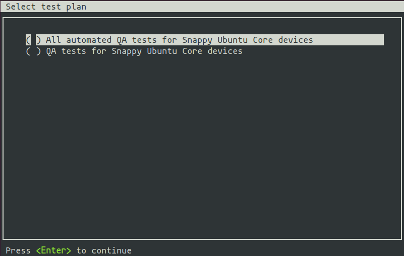
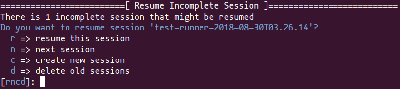
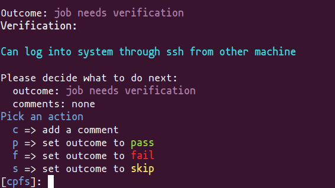
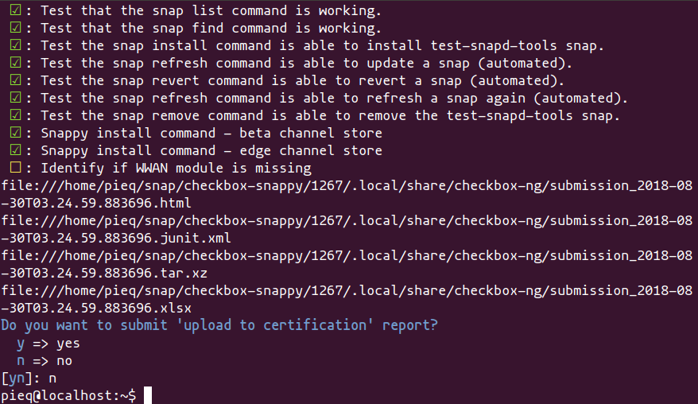

.. _testing-snappy:

Running Checkbox on Ubuntu Core
===============================


Introduction
------------

Checkbox is a hardware testing tool developed by Canonical for certifying
hardware with Ubuntu. Checkbox is free software and is available at
https://launchpad.net/checkbox-project.

To support the release of devices running snappy Ubuntu Core, Canonical has
produced versions of Checkbox tailored specifically for these systems.

This document aims to provide the reader with enough information to install and
run Checkbox on an Ubuntu Core system, and how to view/interpret/submit test
results.


Installation
------------

Installing Ubuntu Core
``````````````````````

You can try out Ubuntu Core on a range of devices or in a virtual machine. For
downloads and instructions see this `page <https://ubuntu.com/download/iot>`.

Installing Checkbox Snap
````````````````````````

Now you are ready to install the Checkbox snap your Ubuntu Core device. It can
be found in the Ubuntu store and there are versions targetting each Ubuntu Core
series. For Series 20::

    $ snap install checkbox-snappy --devmode --channel=20/stable

For Ubuntu Core Series 18::

    $ snap install checkbox-snappy --devmode --channel=18/stable

For Ubuntu Core Series 16::

    $ snap install checkbox-snappy --devmode --channel=16/stable

Running Checkbox
----------------

Launch Checkbox using::

    $ checkbox-snappy.test-runner



Checkbox keeps track of previous test runs, so if a session is not completed,
you’ll be asked to resume your previous run or create a new session:



The first selection screen will ask you to select a test plan to run:


Move the selection with the arrow keys, select with ``Space`` and confirm your
choice by pressing ``Enter``.  The next screen will allow you to fine tune the
tests you want to run:

.. image:: _images/checkbox-snappy-3-select-jobs.png

Tests are grouped by categories. Expand/collapse with ``Enter``, select/unselect
with ``Space`` (also works on categories). Press ``S`` to select all and ``D`` to
deselect all the tests. Press ``H`` to display a help screen with more keyboard
shortcuts.

Start the tests by pressing ``T``.

Checkbox is a test runner able to process fully automated tests/commands and
tests requiring user interaction (whether to setup or plug something to the
device, e.g. USB insertion or to confirm that the device acts as expected, e.g.
a led blinks).

Please refer to the Checkbox documentation to learn more about the supported
types of tests.

A fully automated test will stream stdout/stderr to your terminal allowing you
to immediately look at the I/O logs (if the session is run interactively).
Attachments jobs are treated differently as they could generate lots of I/O.
Therefore their outputs are hidden by default.

Interactive jobs will pause the test runner and detail the steps to complete
the test:




Getting Results
---------------

When the test selection has been run, the first displayed screen will allow you
to re-run failed jobs:

.. image:: _images/checkbox-snappy-5-rerun-jobs.png

Commands to select the tests to rerun are the same used to select tests in the
first selection screen. Here you can re-run your selection with ``R`` or finish
the session by pressing ``F``.

Checkbox will then print the test results in the terminal and save them in
different formats locally on the device (and print their respective filenames):



The resulting reports can be pulled from the system via ``scp`` for instance.
