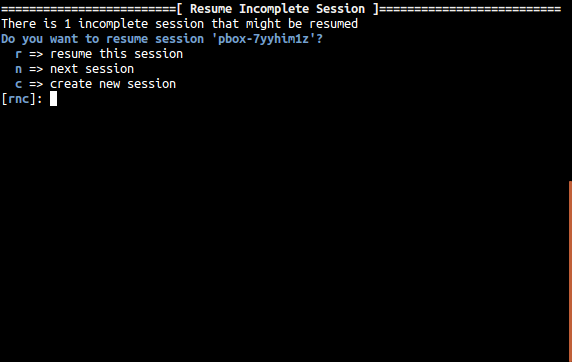
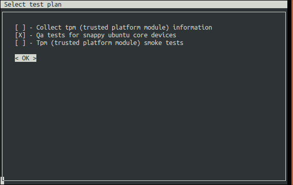
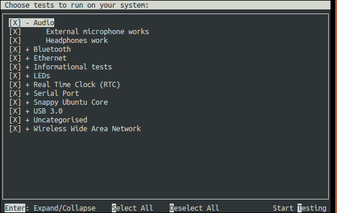
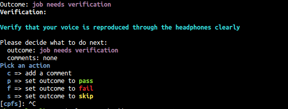
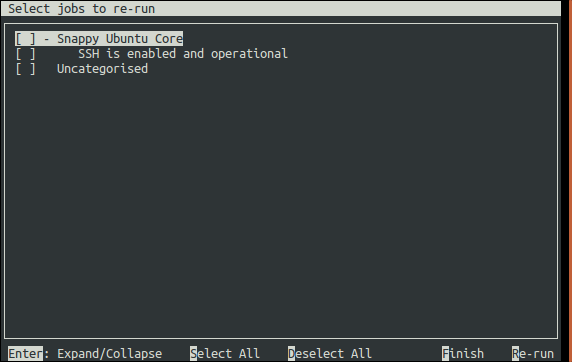
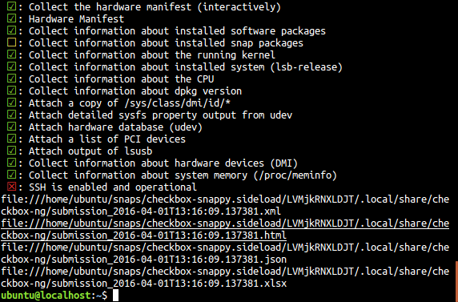

.. _testing-snappy:

Running Checkbox on Ubuntu Core
===============================


Introduction
------------


Checkbox is a hardware testing tool developed by Canonical for certifying
hardware with Ubuntu. Checkbox is free software and is available at
http://launchpad.net/checkbox.

To support the release of devices running snappy Ubuntu Core, Canonical has
produced versions of Checkbox tailored specifically for these systems.

This document aims to provide the reader with enough information to install and
run Checkbox on an Ubuntu Core system, and how to view/interpret/submit test
results.

Installation
------------

Installing Ubuntu Core on KVM
`````````````````````````````
Download the following release of Ubuntu Core (or the one provided by Canonical
for your project)::

    $ wget http://people.canonical.com/~mvo/all-snaps/16/all-snaps-pc.img.xz

Install it on a snappy DUT or boot the img file in kvm with::

    $ unxz all-snaps-pc.img.xz
    $ kvm -m 4096 -redir tcp:8022::22 ./all-snaps-pc.img

Log in as the ubuntu user (password ubuntu)::

    $ ssh -p 8022 ubuntu@localhost

Perform a snappy update::

    $ sudo snap refresh

Installing Checkbox Snap
````````````````````````

Now you are ready to install the checkbox snap,
install it straight from the store.

    $ sudo snap install checkbox-snappy --edge --devmode


Running Checkbox
----------------

Simply launch checkbox using::

    $ checkbox-snappy.test-runner

|


|

Checkbox keeps track are previous test runs, if a session is not completed,
you’ll be asked to resume your previous run or create a new session:

|



|

The first selection screen will ask you to select a test plan to run:

|



|

Move the selection with the arrow keys, select with space and confirm your
choice by moving the selection to <OK> and press Enter.  The next screen will
allow you to fine tune the tests you want to run:

|



|

Tests are grouped by categories, Expand/Collapse with Enter, select/unselect
with space (also works on categories). Press S to select all and D to Deselect
all the tests.

|

Start the tests by pressing T.

|

Checkbox is a test runner able to process fully automated tests/commands and
tests requiring user interaction (whether to setup or plug something to the
device, e.g USB insertion or to confirm that the device acts as expected, e.g a
led blinks).

|

Please refer to the checkbox documentation to learn more about the supported
type of tests.

|

A fully automated test will stream stdout/stderr to your terminal allowing you
to immediately look at the i/o logs (if the session is run interactively).
Attachments jobs are treated differently as they could generate lots of i/o.
Therefore their outputs are hidden by default.

|

Interactive jobs will pause the test runner and details the steps to complete
the test:

|



|

Getting Results
---------------

When the test selection has been run, the first displayed screen will allow you
to re-run failed jobs (e.g. the wireless access point was not properly
configured):

|



|

Commands to select the tests to rerun are the same used to select tests in the
first selection screen. Here you can rerun your selection with R or finish the
session by pressing F.

|

Checkbox will then print the the test results in the terminal and save them in
different formats locally on the device (and print their respective filenames):

|



|

The resulting reports can be easily pulled from the system via SCP, or by
simply copying to a USB stick.
