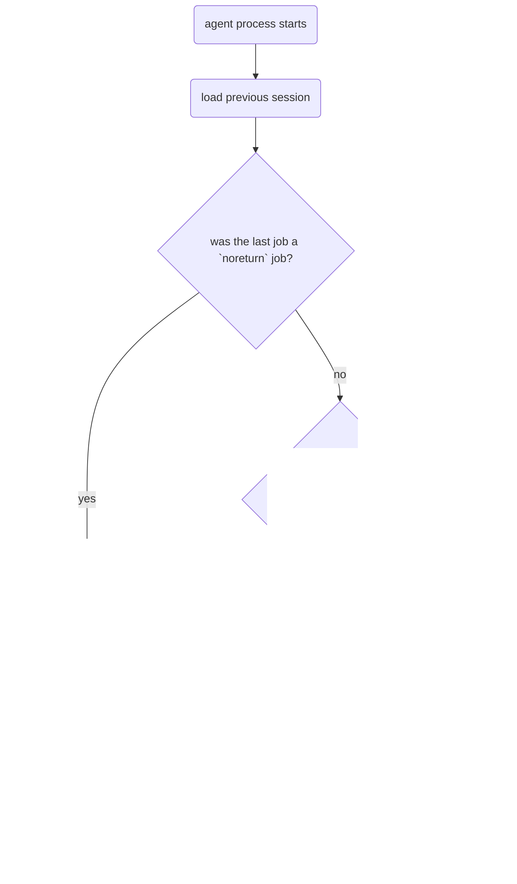

# Checkbox Agent bootup process

```mermaid
graph TD;
  proc("agent process starts")
  load("load previous session")
  resume("resume the previous session")
  resume_crashed("resume the previous session")
  auto_session{"was the previous session non-interactive"}
  mark_pass("mark last running job as passing")
  mark_crash("mark last running job as crashing")
  idle("go into idle state")
  listen("listen for the controllers")
  proc --> load
  last_job{"was the last job a `noreturn` job?"}
  load -->last_job
  last_job-->|yes| resume
  resume --> mark_pass
  
  last_job-->|no| auto_session
  auto_session-->|no| idle
  idle --> listen
  mark_pass --> listen

  auto_session-->|yes| resume_crashed
  resume_crashed --> mark_crash
  mark_crash --> listen

  


```

