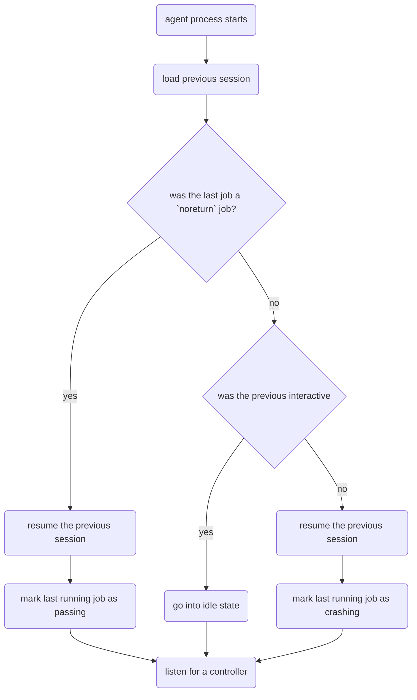

# Checkbox Agent bootup process

```mermaid
graph TD;
  proc("agent process starts")
  load("load previous session")
  resume("resume the previous session")
  resume_crashed("resume the previous session")
  interactive{"was the previous interactive"}
  mark_pass("mark last running job as passing")
  mark_crash("mark last running job as crashing")
  idle("go into idle state")
  listen("listen for a controller")
  proc --> load
  last_job{"was the last job a `noreturn` job?"}
  load -->last_job
  last_job-->|yes| resume
  resume --> mark_pass

  last_job-->|no| interactive
  interactive-->|yes| idle
  idle --> listen
  mark_pass --> listen

  interactive-->|no| resume_crashed
  resume_crashed --> mark_crash
  mark_crash --> listen


```

<https://github.com/canonical/checkbox/pull/875/files#diff-2f4dac5a8b9a64367228fdf46c053d5a334bc0346a31f51f657207600c695ab0R76-R82>
