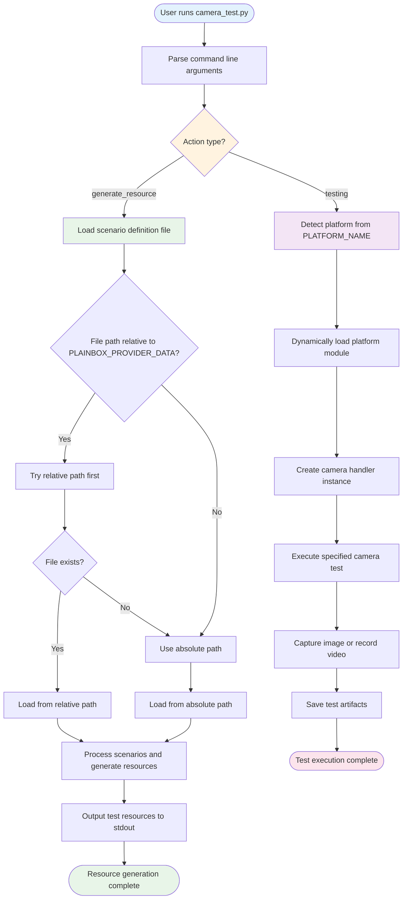

# Vendor Specific Camera Test Jobs

This document introduces the vendor-specific camera test jobs for MIPI camera systems.

## Table of Contents

- [Resource Job](#resource-job)
- [Template Jobs](#template-jobs)
- [Environment Variables](#environment-variables)
- [Code Structure](#code-structure)
- [How It Works](#how-it-works)
- [Adding New Platforms](#contributing-adding-new-platforms)
- [Real Example: Genio 350](#real-example-genio-350)
- [Troubleshooting](#troubleshooting)

## Quick Start

```bash
# 1. Set required environment variables
export PLATFORM_NAME=genio
export MIPI_SCENARIO_DEFINITION_FILE_PATH=data/Genio-MIPI-Camera-TestScenario-TestSetup/genio_mipi_camera_test_scenario_AP1302_AR0430_dual.json

# 2. Generate test resources
python3 camera_test.py generate_resource

# 3. Run a specific test
python3 camera_test.py testing -sn capture_image -p genio -c onsemi_ap1302_ar0430 -m gstreamer -pi csi0 -v mtk-camsv-isp30 -w 1920 -h 1080 -f UYVY
```

## Resource Job

### `mipi_camera_resource`

This resource job requires the Checkbox environment variable `MIPI_SCENARIO_DEFINITION_FILE_PATH`.

**Required Environment Variable:**

- `MIPI_SCENARIO_DEFINITION_FILE_PATH`: Path to the JSON file that defines scenarios for target cameras to perform.

> **Note:** The `MIPI_SCENARIO_DEFINITION_FILE_PATH` can use a relative path from `$PLAINBOX_PROVIDER_DATA`. The system will first try to find the scenario file relative to `PLAINBOX_PROVIDER_DATA`, then fall back to the absolute path if not found.

**Example:**
```bash
# If PLAINBOX_PROVIDER_DATA=/usr/share/checkbox
# You can use:
export MIPI_SCENARIO_DEFINITION_FILE_PATH=data/Genio-MIPI-Camera-TestScenario-TestSetup/scenario.json

# Or use absolute path:
export MIPI_SCENARIO_DEFINITION_FILE_PATH=/usr/share/checkbox/data/Genio-MIPI-Camera-TestScenario-TestSetup/scenario.json
```

## Template Jobs

Two template jobs are generated based on the output of `mipi_camera_resource`:

### Image Capture Job

```text
id: mipi-camera/capture-image_{{ camera }}_{{ physical_interface }}_{{ method }}_{{ width }}x{{ height }}_{{ format }}
```

### Video Recording Job

```text
id: mipi-camera/record-video_{{ camera }}_{{ physical_interface }}_{{ method }}_{{ width }}x{{ height }}@{{ fps }}fps_{{ format }}
```

**Required Environment Variables:**

- `PLATFORM_NAME`: **Required** - The platform name of the Device Under Test (DUT). This variable is used to identify which project's code will be used for camera operations.

**Optional Environment Variables:**

- `MIPI_CAMERA_SETUP_CONF_FILE_PATH`: Path to the setup configuration file in JSON format (required if your camera needs to configure format/resolution of pads or set pad links)

## Environment Variables

### Required

- `PLATFORM_NAME`: The name of the platform (e.g., `genio`, `raspberry`)
- `MIPI_SCENARIO_DEFINITION_FILE_PATH`: Path to the JSON file that defines scenarios for target cameras to perform.

### Optional

- `MIPI_CAMERA_SETUP_CONF_FILE_PATH`: Path to the setup configuration file in JSON format (required if your camera needs to configure format/resolution of pads or set pad links)

### Environment Variable Examples

```bash
# Basic setup for Genio platform
export PLATFORM_NAME=genio
export MIPI_SCENARIO_DEFINITION_FILE_PATH=data/Genio-MIPI-Camera-TestScenario-TestSetup/genio_mipi_camera_test_scenario_AP1302_AR0430_dual.json

# With camera setup configuration
export MIPI_CAMERA_SETUP_CONF_FILE_PATH=data/Genio-MIPI-Camera-TestScenario-TestSetup/genio_mipi_camera_test_setup_AP1302_AR0430_dual.json

# For different platforms
export PLATFORM_NAME=raspberry
export MIPI_SCENARIO_DEFINITION_FILE_PATH=data/Raspberry-MIPI-Camera-TestScenario-TestSetup/raspberry_camera_test_scenario.json
```

## Code Structure

The code structure is organized as follows:

```
camera_test.py              # Main entry point for all camera tests
├── camera_utils.py         # Common utilities, base classes, and shared functionality
├── camera_genio.py         # Genio platform-specific camera implementation
└── camera_<platform>.py    # Platform-specific implementations (e.g., camera_raspberry.py)
```

### File Descriptions

- **`camera_test.py`**: Main script that handles command-line arguments and orchestrates test execution
- **`camera_utils.py`**: Contains base classes, interfaces, and common utilities used across all platforms
- **`camera_genio.py`**: Genio platform-specific camera implementation (example platform)
- **`camera_<platform>.py`**: Template for adding new platform support

### Key Components

- **`CameraInterface`**: Abstract base class that all platform implementations must inherit from
- **`MediaController`**: Handles camera setup and configuration using media-ctl
- **`CameraResources`**: Generates test resources from scenario definition files
- **`camera_factory()`**: Dynamically loads platform-specific modules based on `PLATFORM_NAME`

### How It Works

The camera testing system follows this workflow:

1. **Entry Point**: `camera_test.py` parses command-line arguments and determines the action
2. **Platform Detection**: Uses `PLATFORM_NAME` to identify which platform-specific code to load
3. **Dynamic Loading**: `camera_factory()` function loads the appropriate platform module
4. **Resource Generation**: For `generate_resource` action, processes scenario files to create test resources
5. **Test Execution**: For `testing` action, creates camera handler instance and executes the specified scenario
6. **Artifact Management**: Handles file creation, validation, and cleanup

#### Workflow Diagram



#### Key Functions

- **`camera_factory()`**: Dynamically loads platform-specific modules
- **`list_device_by_v4l2_ctl()`**: Discovers available V4L2 devices
- **`MediaController`**: Handles camera setup and configuration
- **Platform-specific handlers**: Execute actual camera operations

## Contributing: Adding New Platforms

To add support for a new platform, follow this step-by-step guide:

### Prerequisites

- Knowledge of your platform's camera system and V4L2 interface
- Access to your platform's camera hardware for testing

### Step 1: Create Platform-Specific Module

Create `camera_<platform>.py` (e.g., `camera_raspberry.py`):

```python
#!/usr/bin/env python3
import logging
from enum import Enum
from typing import Union, Dict, List
from camera_utils import (
    CameraInterface,
    execute_command,
    SupportedMethods,
    CameraError,
    CameraConfigurationError,
    log_and_raise_error,
)

logger = logging.getLogger(__name__)

class SupportedCamera(Enum):
    """Supported camera modules on your platform."""
    CAMERA_MODEL_1 = "camera_model_1"
    CAMERA_MODULE_2 = "camera_module_2"

def <platform>_camera_factory(camera_module: str) -> CameraInterface:
    """
    Factory function to create camera handler instances.
    
    Args:
        camera_module: String identifier of the camera module
        
    Returns:
        Camera handler class that implements CameraInterface
    """
    camera_handlers = {
        str(SupportedCamera.CAMERA_MODEL_1): CameraModel1Handler,
        str(SupportedCamera.CAMERA_MODULE_2): CameraModule2Handler,
    }
    
    handler_class = camera_handlers.get(camera_module)
    if not handler_class:
        raise CameraError(
            "Unsupported camera module: {}. "
            "Supported modules are: {}".format(
                camera_module, list(camera_handlers.keys())
            )
        )
    return handler_class

class <Platform>BaseCamera(CameraInterface):
    """Base class for your platform camera implementations."""
    
    def __init__(self, v4l2_devices: str):
        super().__init__(v4l2_devices)
        self._v4l2_devices = v4l2_devices
        
    def capture_image(self, width: int, height: int, format: str, 
                     store_path: str, artifact_name: str, 
                     method: str, v4l2_device_name: str) -> None:
        """Implement image capture for your platform."""
        # Your platform-specific implementation
        pass
        
    def record_video(self, width: int, height: int, framerate: int, 
                    format: str, count: int, store_path: str, 
                    artifact_name: str, method: str, 
                    v4l2_device_name: str) -> None:
        """Implement video recording for your platform."""
        # Your platform-specific implementation
        pass

class CameraModel1Handler(<Platform>BaseCamera):
    """Handler for Camera Model 1."""
    def __init__(self, v4l2_devices: str):
        super().__init__(v4l2_devices)
        self._camera = SupportedCamera.CAMERA_MODEL_1

class CameraModule2Handler(<Platform>BaseCamera):
    """Handler for Camera Module 2."""
    def __init__(self, v4l2_devices: str):
        super().__init__(v4l2_devices)
        self._camera = SupportedCamera.CAMERA_MODULE_2
```

**Important Notes:**
- Replace `<platform>` with your actual platform name (e.g., `raspberry`)
- Replace `<Platform>` with your platform name in PascalCase (e.g., `Raspberry`)
- Implement all required methods from `CameraInterface`
- Use proper error handling with the provided exception classes

### Step 2: Update Factory Function

Add your platform to the `camera_factory()` function in `camera_utils.py`:

```python
def camera_factory(platform: str, camera_module: str) -> object:
    if "genio" in platform:
        from camera_genio import genio_camera_factory
        return genio_camera_factory(camera_module=camera_module)
    elif "raspberry" in platform:  # Add your platform
        from camera_raspberry import raspberry_camera_factory
        return raspberry_camera_factory(camera_module=camera_module)
    else:
        log_and_raise_error(
            "Cannot find the '{}' platform".format(platform),
            CameraError,
        )
```

### Step 3: Create Configuration Files

Create test scenario and setup configuration files in the data directory:

```
data/
├── <Platform>-MIPI-Camera-TestScenario-TestSetup/
│   ├── <platform>_camera_test_scenario_camera_model.json
│   ├── <platform>_camera_test_setup_camera_model.json
│   └── Test_Scenario_and_Test_Setup.md
```

### Step 4: Update Documentation

Add your platform to the documentation:

```markdown
### <Platform> Test Scenario and Test Setup Documentation

For comprehensive details about <Platform> configurations, refer to:

**[<Platform> Test Scenario and Test Setup Documentation](../../data/<Platform>-MIPI-Camera-TestScenario-TestSetup/Test_Scenario_and_Test_Setup.md)**
```

### Step 5: Test Your Implementation

Test your platform with:

```bash
# Set environment variables
export PLATFORM_NAME=<platform>
export MIPI_SCENARIO_DEFINITION_FILE_PATH=path/to/your_scenario.json
export MIPI_CAMERA_SETUP_CONF_FILE_PATH=path/to/your_setup.json

# Generate resources
python3 camera_test.py generate_resource -sf path/to/your_scenario.json

# Run tests
python3 camera_test.py testing -sn capture_image -p <platform> -c camera_model_1 ...
```

### Step 6: Best Practices

- **Inherit from base classes**: Use `CameraInterface` and existing utilities
- **Error handling**: Use the provided exception classes (`CameraError`, `CameraConfigurationError`, etc.)
- **Logging**: Use the logger for debugging and information
- **Documentation**: Document your platform-specific requirements
- **Testing**: Test with multiple camera models and scenarios
- **Validation**: Implement proper input validation for your platform

## Real Example: Genio 350

### Configuration Details

- **Cameras**: Dual Onsemi Ap1302 + AR0430
- **Platform**: Genio 350
- **Interface**: MIPI CSI

### Required Files

**Scenario Definition File** (`MIPI_SCENARIO_DEFINITION_FILE_PATH`):
[`genio_mipi_camera_test_scenario_AP1302_AR0430_dual.json`](../../data/Genio-MIPI-Camera-TestScenario-TestSetup/genio_mipi_camera_test_scenario_AP1302_AR0430_dual.json)

**Setup Configuration File** (`MIPI_CAMERA_SETUP_CONF_FILE_PATH`):
[`genio_mipi_camera_test_setup_AP1302_AR0430_dual.json`](../../data/Genio-MIPI-Camera-TestScenario-TestSetup/genio_mipi_camera_test_setup_AP1302_AR0430_dual.json)

### Environment Variable Configuration

```ini
PLATFORM_NAME=genio
MIPI_SCENARIO_DEFINITION_FILE_PATH=path/to/genio_mipi_camera_test_scenario_AP1302_AR0430_dual.json
MIPI_CAMERA_SETUP_CONF_FILE_PATH=path/to/genio_mipi_camera_test_setup_AP1302_AR0430_dual.json
```

**Custom Tool Paths (Optional):**

If you're using patched GStreamer plugins (non-upstream) or want to use system-installed tools, you can override the default paths with these environment variables:

```ini
GST_LAUNCH_BIN=/usr/bin/gst-launch-1.0
MEDIA_CTL_CMD=/usr/bin/media-ctl
V4L2_CTL_CMD=/usr/bin/v4l2-ctl
GST_DISCOVERER=/usr/bin/gst-discoverer-1.0
```

## Platform Test Scenario and Test Setup Documentation

The following sections introduce the test scenario and test setup documentation for each platform.

### Genio Test Scenario and Test Setup Documentation

For comprehensive details about Genio platform configurations, test scenarios, and test setups, refer to:

**[Genio Test Scenario and Test Setup Documentation](../../data/Genio-MIPI-Camera-TestScenario-TestSetup/Test_Scenario_and_Test_Setup.md)**

This documentation includes:

- V4L2 Sensor Configurations
- Mediatek Imgsensor Configurations  
- Available camera models and their configurations
- Quick reference table for all supported configurations

## Troubleshooting

### Common Issues

#### 1. **"Cannot find platform" error**

- **Cause**: Platform module not found or `PLATFORM_NAME` set incorrectly
- **Solution**:
  - Ensure `PLATFORM_NAME` is set correctly
  - Check that platform module exists (e.g., `camera_genio.py`)
  - Verify the platform name matches the module filename

#### 2. **"No video device node found" error**

- **Cause**: Camera not detected or device names don't match
- **Solution**:
  - Run `v4l2-ctl --list-devices` to verify device names
  - Check that camera is properly connected and detected
  - Verify device names in your scenario file match actual devices

#### 3. **JSON parsing errors**

- **Cause**: Invalid JSON syntax or missing required fields
- **Solution**:
  - Validate JSON syntax using online tools (e.g., jsonlint.com)
  - Check for missing required fields in configuration files
  - Ensure proper JSON formatting (commas, quotes, etc.)

#### 4. **Permission denied errors**

- **Cause**: Insufficient permissions to access camera devices
- **Solution**:
  - Ensure user has access to `/dev/video*` devices
  - Run with appropriate permissions or add user to video group
  - Check SELinux/AppArmor policies if applicable

#### 5. **"Camera setup failed" error**

- **Cause**: Media controller configuration issues
- **Solution**:
  - Verify `MIPI_CAMERA_SETUP_CONF_FILE_PATH` is set correctly
  - Check that media-ctl commands in setup file are valid
  - Ensure media device nodes exist and are accessible

### Debugging Tips

1. **Enable verbose logging**: Set log level to DEBUG for more detailed output
2. **Check device status**: Use `v4l2-ctl --list-devices` and `media-ctl -p` to verify hardware
3. **Validate configuration**: Test JSON files with online validators
4. **Check permissions**: Ensure proper access to camera devices and media controllers
5. **Platform-specific issues**: Refer to platform-specific documentation for known issues

### Getting Help

If you encounter issues not covered here:

1. Check the platform-specific documentation
2. Review the test logs for detailed error messages
3. Verify your environment variables and configuration files
4. Test with a known working configuration first
5. Check the troubleshooting section in platform-specific docs

## Summary

This camera testing framework provides a flexible, extensible solution for testing MIPI camera systems across different platforms. Key features include:

### **What You Get**

- **Platform-agnostic design**: Easy to add new platforms
- **Comprehensive validation**: Built-in error checking and validation
- **Flexible configuration**: JSON-based scenario and setup definitions
- **Extensible architecture**: Modular design for easy customization
- **Professional testing**: Industry-standard testing approach

### **Getting Started**

1. **Set environment variables** for your platform
2. **Generate test resources** from scenario files
3. **Run camera tests** with specific parameters
4. **Add new platforms** by following the contribution guide

### **Key Benefits**

- **Reusable code**: Common utilities shared across platforms
- **Easy maintenance**: Centralized validation and error handling
- **Professional quality**: Proper logging, error handling, and documentation
- **Community friendly**: Clear contribution guidelines and examples

### **Next Steps**

- Review the [Genio example](../../data/Genio-MIPI-Camera-TestScenario-TestSetup/) for a working implementation
- Check the [platform-specific documentation](../../data/) for detailed configurations
- Follow the [contribution guide](#contributing-adding-new-platforms) to add your platform
- Use the [troubleshooting section](#troubleshooting) for common issues
