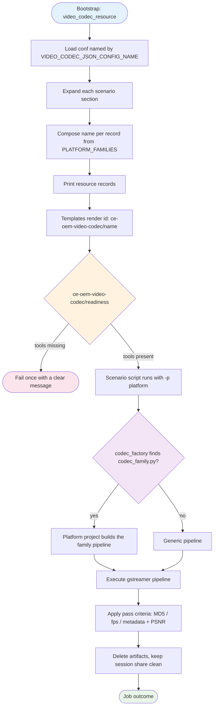

# Video Codec Test Jobs

This document introduces the video codec test jobs for GStreamer hardware
encoders and decoders. The framework follows the same concept as the
camera framework (`units/camera`): a per-DUT JSON conf file declares what
the platform tests, one resource job composes the job names, one generic
template per scenario renders them, and per-family pipeline modules are
resolved by a factory.

## Table of Contents

- [Resource Job](#resource-job)
- [Readiness Job](#readiness-job)
- [Template Jobs](#template-jobs)
- [Environment Variables](#environment-variables)
- [Code Structure](#code-structure)
- [How It Works](#how-it-works)
- [Contributing: Adding New Platforms](#contributing-adding-new-platforms)
- [Real Example: Genio 1200](#real-example-genio-1200)
- [Scenario Documentation](#scenario-documentation)
- [Troubleshooting](#troubleshooting)

## Quick Start

```bash
# 1. Set required environment variables
export VIDEO_CODEC_JSON_CONFIG_NAME=genio-1200
export VIDEO_CODEC_TESTING_DATA=$HOME/video

# 2. Generate test resources
python3 gst_resources_generator.py "$VIDEO_CODEC_JSON_CONFIG_NAME" -gtdp "$VIDEO_CODEC_TESTING_DATA"

# 3. Run a specific test
python3 gst_encoder_psnr.py -p genio-1200 -ep v4l2h264enc -cs NV12 -wi 1920 -hi 1080 -f 30 -m mp4mux
```

## Resource Job

### `video_codec_resource`

This resource job requires the Checkbox environment variables
`VIDEO_CODEC_JSON_CONFIG_NAME` and `VIDEO_CODEC_TESTING_DATA`.

**Required Environment Variables:**

- `VIDEO_CODEC_JSON_CONFIG_NAME`: Name of the conf file (without `.json`)
  that declares which scenarios, plugins and resolutions the platform
  tests. The name doubles as the platform identity.
- `VIDEO_CODEC_TESTING_DATA`: Directory that holds (or receives) the
  golden sample files.

> **Note:** The conf name is resolved under
> `$PLAINBOX_PROVIDER_DATA/video-codec-test-confs/<name>.json`; a full
> path also works. Conf files follow one naming rule:
> `<family>[-<board>].json` — the file name starts with its platform
> family (e.g. `genio-1200.json`, `imx-8mp.json`, `rzg2l.json`,
> `dragonwing.json`), because the family is derived from that prefix.

**Example:**
```bash
# Resolved under PLAINBOX_PROVIDER_DATA:
export VIDEO_CODEC_JSON_CONFIG_NAME=rzg2l

# The resource then emits one record per generated job, including the
# composed `name` field that becomes the job id.
```

## Readiness Job

### `ce-oem-video-codec/readiness`

Checks once that the GStreamer binaries (`GST_LAUNCH_BIN`,
`GST_DISCOVERER`, with the same defaults the scripts use) are available.
Every scenario template depends on it, so a misconfigured DUT fails one
job with a clear message instead of failing every generated job with
subprocess noise.

## Template Jobs

Six template jobs are generated based on the output of
`video_codec_resource`. Every template renders the generic id
`ce-oem-video-codec/{{ name }}` — the per-family id shapes live in the
`PLATFORM_FAMILIES` table in `bin/codec_platforms.py`, and
`tests/video_codec_job_names.txt` freezes every emitted name so ids
cannot change silently. All templates carry `flags: also-after-suspend`
and require the `has_video_codec` manifest entry.

### Decoder MD5 Checksum Comparison Job

```text
id: ce-oem-video-codec/gst_video_decoder_md5_checksum_comparison-{{ decoder_plugin }}-{{ width }}x{{ height }}-{{ color_space }}
```

Decodes a golden sample with the declared decoder plugin and compares the
produced MD5 checksums against the golden references stored under
`$VIDEO_CODEC_TESTING_DATA/gst_video_decoder_md5_checksum_comparison/golden_md5_checksum/<conf>/`.
Platforms with their own decoder pipeline expose
`build_decoder_md5_checksum_command(...)` in their `codec_<family>.py`;
everyone else uses the generic pipeline.

**Conf section:**
```json
"gst_video_decoder_md5_checksum_comparison": [
  {
    "decoder_plugin": "v4l2h264dec",
    "resolutions": [{"width": 320, "height": 320}],
    "color_spaces": ["NV12", "I420"],
    "source_format": "mp4"
  }
]
```

### Audio/Video Synchronization Job (manual)

```text
id: ce-oem-video-codec/gst_v4l2_audio_video_synchronization-{{ decoder_plugin }}-{{ golden_sample_file_name }}-{{ video_sink }}
```

Plays a golden sample and asks the operator to verify the audio and video
stay synchronized. The video sink is picked from the conf's
`video_sinks` map by image type (desktop / server / core), and a
`capssetter_pipeline` can be injected per sample when the stream needs
its caps rewritten. Platforms with their own AV-sync pipeline expose
`build_audio_video_sync_command(...)` in their `codec_<family>.py`;
everyone else uses the generic pipeline.

**Conf section:**
```json
"gst_v4l2_audio_video_synchronization": {
  "video_sinks": {
    "on_desktop": "waylandsink",
    "on_server": "kmssink connector-id=32 driver-name=mediatek",
    "on_core": "kmssink connector-id=32 driver-name=mediatek"
  },
  "cases": [
    {
      "decoder_plugin": "v4l2h264dec",
      "golden_sample_files": [
        {"file_name": "480p.mp4", "capssetter_pipeline": ""}
      ]
    }
  ]
}
```

### Decoder Performance Job

```text
id: ce-oem-video-codec/gst_video_decoder_performance_fakesink-{{ decoder_plugin }}
```

Decodes a golden sample into `fakesink` and reads the fps statistics from
`fpsdisplaysink`. Pass criteria: no dropped frames, and every average fps
value at or above `minimum_fps`. Families whose single decoder element
serves several codecs set `perf_id_includes_sample` in their
`PLATFORM_FAMILIES` entry, which appends the golden-sample name to the id
to keep it unique per codec. Like every video codec job, it runs as the
normal user — nothing in the framework needs root.

**Conf section:**
```json
"gst_video_decoder_performance_fakesink": [
  {
    "decoder_plugin": "omxh264dec",
    "golden_sample_file": "1080p_30fps_h264.mp4",
    "minimum_fps": 30
  }
]
```

### Encoder PSNR Job

```text
id: ce-oem-video-codec/[<family prefix>-]gst_encoder_psnr-{{ encoder_plugin }}-{{ width }}x{{ height }}@{{ framerate }}fps[-{{ color_space }}][-{{ mux }}]
```

Encodes a golden sample with the encoder under test, validates the
artifact metadata (resolution, framerate, codec) with
`gst-discoverer-1.0`, and compares the artifact against the golden
reference — the average PSNR must reach 30 dB. Platforms with their own
encoder pipeline expose `create_encoder_psnr_project(args)` in their
`codec_<family>.py`; everyone else uses the generic reference pipeline
(decodebin → videoconvert → encoder → mux). Which optional fields the id
appends is declared per family in `PLATFORM_FAMILIES`
(`encoder_id_suffix_fields`).

**Conf section:**
```json
"gst_encoder_psnr": [
  {
    "encoder_plugin": "v4l2h264enc",
    "resolutions": [{"width": 1920, "height": 1080, "fps": 30}],
    "color_spaces": ["NV12"],
    "mux": ["mp4mux"]
  }
]
```

### Transform Rotate and Flip Job

```text
id: ce-oem-video-codec/gst_transform_rotate_and_flip-{{ encoder_plugin }}_{{ action }}_{{ width }}x{{ height }}_{{ framerate }}fps
```

Rotates (90/180/270) or flips (vertical/horizontal) a stream while
encoding and validates the produced artifact. The generic `v4l2convert`
pipeline is the default; platforms with their own transform pipeline
expose `create_transform_rotate_and_flip_project(args)` in their
`codec_<family>.py`. Currently only genio declares the scenario (using
the default).

**Conf section:**
```json
"gst_transform_rotate_and_flip": [
  {
    "encoder_plugin": "v4l2h264enc",
    "actions": ["rotate_90", "vertical_flip"],
    "resolutions": [{"width": 1920, "height": 1080, "fps": 60}]
  }
]
```

### Transform Resize Job

```text
id: ce-oem-video-codec/gst_transform_resize-{{ encoder_plugin }}_from_{{ width_from }}x{{ height_from }}_{{ framerate }}fps_to_{{ width_to }}x{{ height_to }}
```

Scales a stream up or down while encoding and validates the produced
artifact. The generic `v4l2convert` pipeline is the default; platforms
with their own transform pipeline expose
`create_transform_resize_project(args)` in their `codec_<family>.py`.
Currently only genio declares the scenario (using the default).

**Conf section:**
```json
"gst_transform_resize": [
  {
    "encoder_plugin": "v4l2h264enc",
    "resolutions": [
      {"width_from": 3840, "height_from": 2160, "fps": 60,
       "width_to": 1920, "height_to": 1080}
    ]
  }
]
```

## Environment Variables

### Required

- `VIDEO_CODEC_JSON_CONFIG_NAME`: Conf file name, which is also the
  platform identity (e.g. `genio-1200`, `rzg2l`)
- `VIDEO_CODEC_TESTING_DATA`: Directory holding the golden sample files
  (missing samples are fetched from the testing-data store on demand and
  removed after the job)

### Optional

- `GST_LAUNCH_BIN`: Override for `gst-launch-1.0` (e.g. a snap alias)
- `GST_DISCOVERER`: Override for `gst-discoverer-1.0`
- `USER_DEFINED_GST_LD_LIBRARY_PATH` / `USER_DEFINED_GST_PLUGIN_PATH`:
  Library/plugin paths appended when the GStreamer binary is not a snap

### Environment Variable Examples

```ini
# Basic setup for a Genio 1200 board
VIDEO_CODEC_JSON_CONFIG_NAME=genio-1200
VIDEO_CODEC_TESTING_DATA=/home/user/video

# Using the GStreamer stack from a snap
GST_LAUNCH_BIN=/snap/bin/gst-launch-1.0
GST_DISCOVERER=/snap/bin/gst-discoverer-1.0
```

## Code Structure

The code structure is organized as follows:

```
gst_resources_generator.py            # Resource job: conf -> job records (composes the names)
gst_encoder_psnr.py                   # Encoder PSNR scenario entry point
gst_video_decoder_performance.py      # Decoder performance scenario entry point
gst_video_decoder_md5_checksum_comparison.py  # Decoder MD5 scenario entry point
gst_v4l2_audio_video_synchronization.py       # AV-sync scenario entry point
gst_transform_rotate_and_flip.py      # Rotate/flip scenario entry point (genio-only)
gst_transform_resize.py               # Resize scenario entry point (genio-only)
├── gst_utils.py                      # Shared helpers, PipelineInterface ABC, download manager
├── codec_platforms.py                # PLATFORM_FAMILIES table + codec_factory()
├── codec_base.py                     # BaseCodecProject basic class (inherits the ABC)
├── codec_genio.py                    # MediaTek Genio pipelines
├── codec_dragonwing.py               # Qualcomm Dragonwing pipelines
├── codec_imx.py                      # NXP i.MX8M pipelines
├── codec_rz.py                       # Renesas RZ pipelines
└── codec_<family>.py                 # Template for adding new platform support
```

### File Descriptions

- **`gst_resources_generator.py`**: Reads the conf, expands every
  scenario section and prints one record per job, including the composed
  `name` the templates render as the job id
- **`gst_utils.py`**: Common utilities — command execution, metadata
  validation, PSNR comparison, golden-sample download managers, and the
  `PipelineInterface` ABC
- **`codec_platforms.py`**: The single place that knows which platforms
  exist — the `PLATFORM_FAMILIES` table and `codec_factory()`
- **`codec_base.py`**: The `BaseCodecProject` basic class every platform
  project inherits
- **`codec_<family>.py`**: Per-family pipeline modules

### Key Components

- **`PipelineInterface`**: Abstract base class for pipeline projects
  (`build_pipeline`, `artifact_file`, `psnr_reference_file`)
- **`BaseCodecProject`**: Basic class implementing the ABC with the
  shared fields and defaults; platform projects fill
  `self._pipeline_builders` and override only what differs — the same
  way the camera platform classes inherit their base camera class
- **`PLATFORM_FAMILIES`**: Declarative dataclass table of the per-family
  job-id shapes
- **`codec_factory()`**: Dynamically loads `codec_<family>.py` based on
  the conf-name prefix, like `camera_factory()` does for cameras

## How It Works

The video codec testing system follows this workflow:

1. **Resource Generation**: `gst_resources_generator.py` loads the conf
   named by `VIDEO_CODEC_JSON_CONFIG_NAME`, dispatches each scenario key
   to its same-named handler and prints one record per job with the
   composed `name`
2. **Template Rendering**: each scenario template filters the resource on
   its `scenario` field and renders `id: ce-oem-video-codec/{{ name }}`
3. **Readiness**: the readiness job verifies the GStreamer tools once;
   every generated job depends on it
4. **Platform Dispatch**: the scenario scripts receive the platform from
   the resource (`-p`), and `codec_factory()` loads the family's
   `codec_<family>.py` module — platforms without a module use the
   generic pipelines
5. **Test Execution**: the project class builds the family's pipeline,
   the script executes it and applies the pass criteria (MD5 match,
   fps threshold, metadata + PSNR ≥ 30 dB)
6. **Artifact Management**: golden samples are downloaded on demand into
   `VIDEO_CODEC_TESTING_DATA` and cleaned up; encode artifacts land in
   `PLAINBOX_SESSION_SHARE` and are deleted after validation

#### Workflow Diagram



#### Key Functions

- **`codec_factory()`**: Resolves the platform to its family module
- **`compose_encoder_psnr_name()` / `compose_decoder_performance_name()`**:
  Compose the job names from the `PLATFORM_FAMILIES` shapes
- **`manage_test_file_by_name()` / `manage_test_file_by_params()`**:
  Download and clean up golden samples around a test
- **`MetadataValidator` / `compare_psnr()`**: Encoder artifact validation

## Contributing: Adding New Platforms

To add support for a new platform, follow this step-by-step guide:

### Prerequisites

- Knowledge of your platform's GStreamer hardware codec elements
- Access to your platform's hardware for testing

### Step 1: Create the Conf File

Create `data/video-codec-test-confs/<family>[-<board>].json` with the
scenario sections the platform supports (copy an existing conf as
reference — e.g. `rzg2l.json` for a small one). The file name must start
with the platform family name:

```json
{
    "gst_video_decoder_performance_fakesink": [
        {
            "decoder_plugin": "yourh264dec",
            "golden_sample_file": "1080p_30fps_h264.mp4",
            "minimum_fps": 30
        }
    ],
    "gst_encoder_psnr": [
        {
            "encoder_plugin": "yourh264enc",
            "resolutions": [{"width": 1920, "height": 1080, "fps": 30}],
            "color_spaces": ["NV12"]
        }
    ]
}
```

### Step 2: Add the Platform Family Entry

Add one `PlatformFamily` entry to `PLATFORM_FAMILIES` in
`bin/codec_platforms.py`, keyed by the family name (boards of an
existing family need no new entry — their conf names already match):

```python
PLATFORM_FAMILIES = {
    ...
    "yourfamily": PlatformFamily(
        id_prefix="yourfamily",
        encoder_id_suffix_fields=("color_space",),
        # set perf_id_includes_sample=True only when one decoder
        # element serves several codecs
    ),
}
```

### Step 3: Create the Platform Module

Add `bin/codec_<family>.py` when the platform needs its own pipelines —
platforms that only use the generic pipelines can skip the module
entirely. The project class inherits `BaseCodecProject` and overrides
only what differs:

```python
#!/usr/bin/env python3
"""Your platform pipelines for the video-codec scenarios."""

import argparse

from codec_base import BaseCodecProject
from gst_utils import (
    GST_LAUNCH_BIN,
    GStreamerEncodePlugins,
    get_test_file_path_by_params,
)


def create_encoder_psnr_project(args: argparse.Namespace):
    """Create the encoder-PSNR pipeline project for your platform."""
    return YourPlatformProject(
        platform=args.platform,
        codec=args.encoder_plugin,
        color_space=args.color_space,
        width=args.width,
        height=args.height,
        framerate=args.framerate,
    )


class YourPlatformProject(BaseCodecProject):
    """Your platform pipeline handler and builder."""

    def __init__(self, platform, codec, color_space, width, height,
                 framerate):
        super().__init__(
            platform=platform,
            codec=codec,
            width=width,
            height=height,
            framerate=framerate,
            color_space=color_space,
        )
        self._golden_sample = get_test_file_path_by_params(
            self._width, self._height, self._framerate, "h264"
        )
        # codec value -> bound builder; build_pipeline() dispatches
        # through this mapping (inherited from BaseCodecProject)
        self._pipeline_builders = {
            GStreamerEncodePlugins.V4L2H264ENC.value: (
                self._h264_pipeline_builder
            ),
        }

    def _h264_pipeline_builder(self) -> str:
        return (
            "{} filesrc location={} ! decodebin ! videoconvert !"
            " video/x-raw,format={} ! {} ! h264parse ! mp4mux !"
            " filesink location={}"
        ).format(
            GST_LAUNCH_BIN,
            self._golden_sample,
            self._color_space,
            self._codec,
            self.artifact_file,
        )
```

Every scenario ships a generic default pipeline and resolves platform
overrides through the same module, so a platform only ever needs its
`codec_<family>.py` plus the `PlatformFamily` entry — and only for the
scenarios where the generic pipeline does not fit. The hooks a module
can expose (all optional):

- `create_encoder_psnr_project(args)` — encoder PSNR (see any
  `codec_<family>.py`)
- `build_decoder_performance_command(...)` — decoder performance (see
  `codec_imx.py` or `codec_rz.py`)
- `build_decoder_md5_checksum_command(...)` — decoder MD5 comparison
- `build_audio_video_sync_command(...)` — AV synchronization
- `create_transform_rotate_and_flip_project(args)` /
  `create_transform_resize_project(args)` — the transform scenarios

**Important Notes:**
- Inherit `BaseCodecProject` — it provides `artifact_file`,
  `psnr_reference_file` and the `build_pipeline()` dispatch; override a
  property only when the default does not fit (e.g. a different artifact
  container for one codec)
- Add new encoder elements to `GStreamerEncodePlugins` and the
  `MetadataValidator` codec map in `gst_utils.py`

### Step 4: Provide the Golden Samples

Provide the golden samples the conf references in the testing-data store
(https://github.com/canonical/CodecCrafter) so the download manager can
fetch them.

### Step 5: Test Your Implementation

```bash
# Generate resources and check the produced job names
export VIDEO_CODEC_JSON_CONFIG_NAME=yourfamily-board
python3 gst_resources_generator.py "$VIDEO_CODEC_JSON_CONFIG_NAME" -gtdp "$VIDEO_CODEC_TESTING_DATA"

# Run the unit tests
python3 -m unittest discover -s tests -p "test_codec*.py" -p "test_gst*.py"

# Your new conf adds new job names, so regenerate the frozen snapshot
# (existing platforms' names must NOT change in the diff):
python3 tests/test_video_codec_name_snapshot.py --regen
```

### Step 6: Best Practices

- **Inherit the basic class**: `BaseCodecProject` keeps every platform
  module on one aligned format
- **Never change existing job ids**: the snapshot test fails on any
  change — regenerate only for your new platform's additions
- **Declare, don't code, id shapes**: the family entry in
  `PLATFORM_FAMILIES` is the only place an id shape is defined
- **Reuse the golden samples**: pick resolutions that already exist in
  the testing-data store where possible
- **Testing**: add a `tests/test_codec_<family>.py` covering your
  pipelines and factory routing

## Real Example: Genio 1200

### Configuration Details

- **Platform / conf**: `genio-1200` (`data/video-codec-test-confs/genio-1200.json`)
- **Scenarios**: all six — decoder MD5, AV-sync (manual), decoder
  performance, encoder PSNR, rotate/flip, resize
- **Pipelines**: `bin/codec_genio.py` (`GenioProject`)

### Environment Variable Configuration

```ini
VIDEO_CODEC_JSON_CONFIG_NAME=genio-1200
VIDEO_CODEC_TESTING_DATA=/home/user/video
```

### Generated Job Examples

```text
ce-oem-video-codec/genio-gst_encoder_psnr-v4l2h264enc-1920x1080@30fps-NV12-mp4mux
ce-oem-video-codec/gst_video_decoder_performance_fakesink-v4l2h264dec
ce-oem-video-codec/gst_video_decoder_md5_checksum_comparison-v4l2h264dec-320x320-NV12
ce-oem-video-codec/gst_transform_resize-v4l2h264enc_from_3840x2160_60fps_to_1920x1080
```

## Scenario Documentation

Before starting the testing, please read the
[OQ013 - Video Codec Testing Document](https://docs.google.com/document/d/1yuAdse3u64QZGCL2VQ4_PpuPIC0i1yXqHxKI6660WFg/edit?usp=sharing)
to understand the overall testing process and the scenarios that
interest you, including the
[decoder MD5 checksum comparison detail](https://docs.google.com/document/d/1yuAdse3u64QZGCL2VQ4_PpuPIC0i1yXqHxKI6660WFg/edit#heading=h.rh805u3vq3ig).

## Troubleshooting

### Common Issues

#### 1. **"Error: unknown scenario '...' in '...' conf"**

- **Cause**: A conf section key does not match a scenario handler name
- **Solution**: Use exactly the six scenario keys shown in
  [Template Jobs](#template-jobs)

#### 2. **"Error: Cannot get the implementation for '<platform>'"**

- **Cause**: The conf name does not start with a known family in
  `PLATFORM_FAMILIES`, so no pipelines can be resolved
- **Solution**: Check the conf file name against the family keys; add a
  `PlatformFamily` entry for a new family

#### 3. **"Error: VIDEO_CODEC_TESTING_DATA is not set"**

- **Cause**: The resource job ran without the testing-data directory
- **Solution**: Set `VIDEO_CODEC_TESTING_DATA` in the Checkbox
  configuration

#### 4. **Readiness job fails / "Error: <tool> not found"**

- **Cause**: The GStreamer binaries are not on PATH, or the
  `GST_LAUNCH_BIN` / `GST_DISCOVERER` overrides point to missing tools
- **Solution**: Install GStreamer, or fix the overrides (on Ubuntu Core
  images point them at the snap that ships the stack)

#### 5. **"Error: Golden sample '...' doesn't exist" / download failures**

- **Cause**: The sample the conf references is not in the testing-data
  store, or the DUT cannot reach it
- **Solution**: Provision the sample in CodecCrafter, or pre-download it
  into `VIDEO_CODEC_TESTING_DATA`

#### 6. **`tests/test_video_codec_name_snapshot.py` fails after a change**

- **Cause**: The change alters emitted job names — the names are the job
  ids
- **Solution**: If the id change is agreed and deliberate, regenerate
  with `--regen`; otherwise fix the change so existing names stay intact

### Getting Help

1. Review the job output for the exact failing gstreamer pipeline — every
   script logs the full command it executes
2. Re-run the resource generator manually to inspect the records
3. Test with a known working conf (e.g. `rzg2l`) first
4. Check the [OQ013 document](#scenario-documentation) for the scenario's
   expected process

## Summary

This video codec testing framework provides a flexible, extensible
solution for testing GStreamer hardware codecs across different
platforms, on the same concept as the camera framework. Key features:

### **What You Get**

- **Declarative coverage**: one JSON conf per DUT decides what runs
- **Stable job ids**: names composed in one place, frozen by a snapshot
  test
- **Aligned platform modules**: ABC → basic class → platform project
- **Quality gates**: MD5 comparison, fps criteria, metadata + PSNR

### **Getting Started**

1. **Set environment variables** for your platform
2. **Generate test resources** from the conf file
3. **Run codec tests** with specific parameters
4. **Add new platforms** by following the contribution guide

### **Next Steps**

- Review the [Genio 1200 example](#real-example-genio-1200) for a full
  coverage conf
- Follow the [contribution guide](#contributing-adding-new-platforms) to
  add your platform
- Use the [troubleshooting section](#troubleshooting) for common issues
