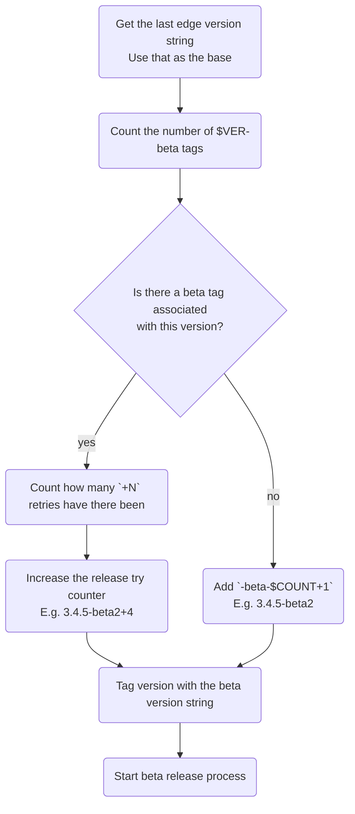
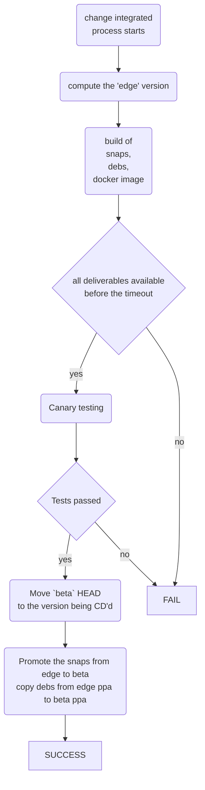
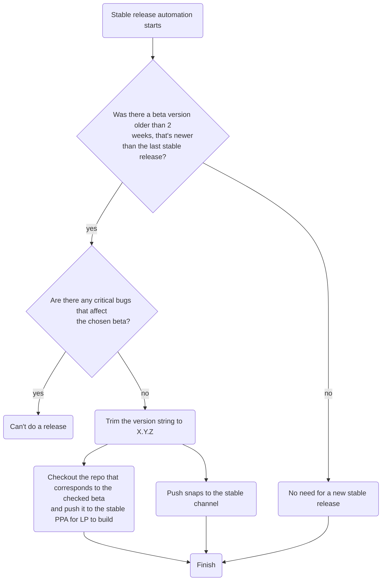

# Continuous delivery of Checkbox

## Axioms

* a tag can be attached to one unique version in git
* "risk" annotation like "beta" doesn't uniquely identify a version

## Assertions

* two deliverables with the same version string have the same contents
* there can be multiple deliverables with different version strings
  identifying the same deliverable
* the version of deliverables other than stable is always +1 compared to
  the last release stable.
  The "+1" may mean major, minor, or patch section of version string,
  depending on the contents of changes since last stable release, following
  Semantic versioning 2.0.
*

## Preferences

* the same deliverable is promoted from a "more risky" channel to a less
  risky one without rebuilding. E.g. beta -> stable.

## Calculating the Edge version string

## Getting to a new beta version

## Getting a new stable version

