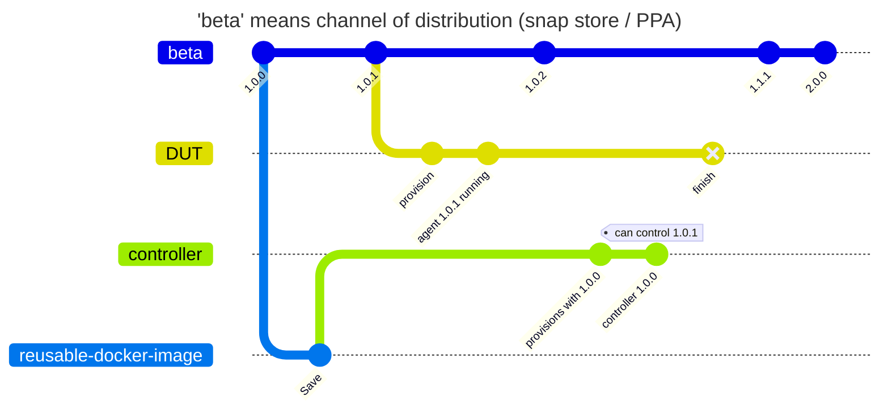
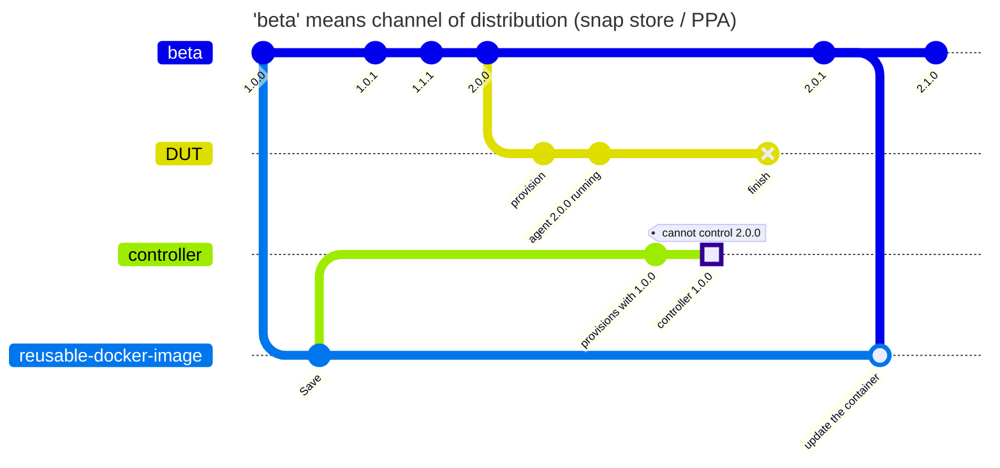
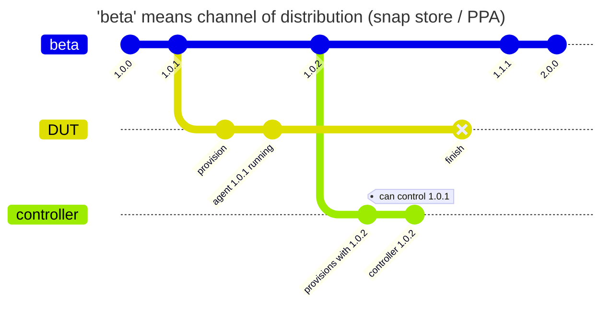
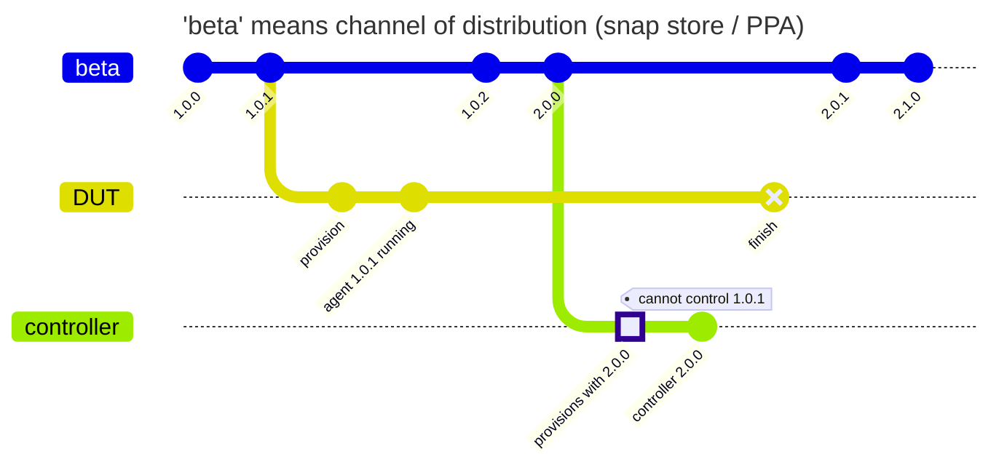

# The controller mismatch problem

## IMPORTANT DISCLAIMER

THE DIAGRAMS DRAWN HERE DO NOT DESCRIBE GIT HISTORY

THEY DESCRIBE INTERACTION BETWEEN ENTITIES IN A CHRONOLOGICAL ORDER

## Current state

We keep a reusable controller docker image that gets updated manually.
We are **guaranteed** to be out of sync every time a new major version is released.

### Happy case

The controller in the docker image is fresh enough to control the agent.



### Unhappy case

The controller in the docker image is stale and cannot control the agent.



## proposed solution 1: provisioning controler ad hoc (rejected)

The controller is being provisioned when the testing commences using the same channel
as the one that was used on the DUT. This creates a window where a race condition can
occur in which a breaking change may have been released. And because the installation
of Checkbox on DUT and controller is not atomic, they can be mismatched.

### happy case



### unhappy case



## Proposed solution with versioned docker images

The controller image used always corresponds to the version installed on the DUT.
Same version of both ends means no opportunity for a mismatch.

```mermaid
---
title: "'beta' means channel of distribution (snap store / PPA)"
---

%%{init: { 'gitGraph': {'mainBranchName': 'beta'}}}%%

gitGraph LR:
   commit id:"1.0.0"

   branch checkbox-docker
   checkout beta
   commit id:"1.0.1"
   checkout checkbox-docker
   merge beta id:"update to 1.0.1"
   branch controller order:2
   checkout beta
   branch DUT order:1

   commit id:"provision"
   commit id:"agent 1.0.1 running"

   checkout beta
   commit id:"1.0.2"
   checkout checkbox-docker
   merge beta id:"update to 1.0.2"
   checkout beta
   commit id:"2.0.0"
   checkout checkbox-docker
   merge beta id:"update to 2.0.0"
   checkout beta


   checkout controller

   commit id:"provisions to DUT's version"
   commit id:"controller 1.0.1" tag: "can control 1.0.1"

   checkout DUT
   commit type:REVERSE id:"finish"

   checkout beta

   commit id:"2.0.1"
   checkout checkbox-docker
   merge beta id:"update to 2.0.1"
   checkout beta
   commit id:"2.1.0"
   checkout checkbox-docker
   merge beta id:"update to 2.1.0"
   checkout beta

```
