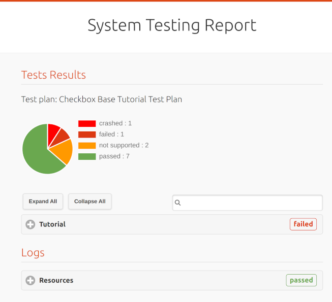

.. _test-report:

==================
Review Test Report 
==================

Once you finish your first test run, you may want to review the test reports. 
Checkbox generates test reports in different formats that can be used to 
easily share the results of a test session. By default, a :ref:`text summary<text-summary>` 
and :ref:`submission files<submission-files>` are created. This section will 
provide you with information on where to locate the report files and their 
respective contents.

.. note::

    You can tailor desired reports in your launcher file, or define your own 
    exporter to customize the reports. See :doc:`launcher<../../reference/launcher>` 
    and :doc:`exporter<../../reference/units/exporter>` for more details.

.. _text-summary:

Text Summary
============

You should see a text summary displayed in the console once all jobs are 
completed. The result of each job is presented in the format: ``outcome: 
summary``, and it looks like:

.. code-block:: none

    ☑ : A job that always passes
    ☒ : A job that always fails
    ⚠ : A job that always crashes
    ☑ : A job that depends on other job that passes
    ☐ : A job that is skipped because it depends on a job that fails
    ☑ : A job that generates different resources for tutorial purposes
    ☑ : A job that requires a resource and it is available
    ...

Checkout this table to map outcome symbols to their corresponding descriptions:

.. list-table::
    :header-rows: 1
    :widths: 40 60

    * - symbol
      - outcome
    * - 
      - job didn't run
    * - ☑
      - job passed
    * - ☒
      - job failed
    * - ☐
      - job skipped, job cannot be started
    * - ‒
      - job is not implemented
    * - ⁇
      - job needs verification
    * - ⚠
      - job crashed

As text summary only provides an overview, for more in-depth information, you 
will need to review submission files.

.. _submission-files:

Submission Files
================
 
In Checkbox, submission files encompass report files in various formats (HTML, 
JSON, and JUnit XML) along with attachments like I/O logs and binary files. 
These files serve the purpose of sharing test results with other users or 
services, such as Jenkins and :term:`Certification Website`. 

You can find absolute paths of submission files displayed in the console right 
after the text summary block. 

.. code-block:: none

    file:///home/user/.local/share/checkbox-ng/submission_2023-07-19T07.36.00.399658.html
    file:///home/user/.local/share/checkbox-ng/submission_2023-07-19T07.36.00.399658.junit.xml
    file:///home/user/.local/share/checkbox-ng/submission_2023-07-19T07.36.00.399658.tar.xz

Head to the folder ``~/.local/share/``, you should find submission files 
organized as follows:

.. code-block:: none

    ├── html
    ├── junit
    └── tar.xz
         ├── html
         ├── json
         ├── junit
         └── attachments

Now, let's explore each of the submission files together!

``html``
    Open HTML files with your preferred web browser, you will see a System 
    Testing Report with the following sections.
    
    - System Information
    - Tests Results
    - Logs

    
    Tutorial HTML report

    
You can expand entries in Tests Results and Logs sections to access more
detailed information. 

Additionally, if the report is more complex, you can utilize the *search bar* to
filter specific tests for easier navigation. For instance, if you type "audio"
in the search bar, you can view all test results related to audio testing.

.. figure:: ../../_images/checkbox-test-report.png
    
    An example of beginning of a HTML report

``json``
    JSON files store session exports that are compatible for submission to 
    Certification Website.

``junit``
    `JUnit XML <https://windyroad.com.au/dl/Open%20Source/JUnit.xsd>`_ files 
    contain test data that can be read by Jenkins.

``tar.xz``
    The xz compressed tarball is a comprehensive archive that includes the 
    aforementioned reports and all associated attachments, such as I/O logs 
    and binary files. You can extract the tarball with ``tar -xf 
    submission.tar.xz -C /path/to/destination``.

    Certification Website only accepts submissions tarballs, from which it 
    extracts the ``submission.json`` file to create a new test report in the 
    database. 

For a detailed description of the ``submission.json`` file, see the :doc:`../../reference/submission-schema` reference.
