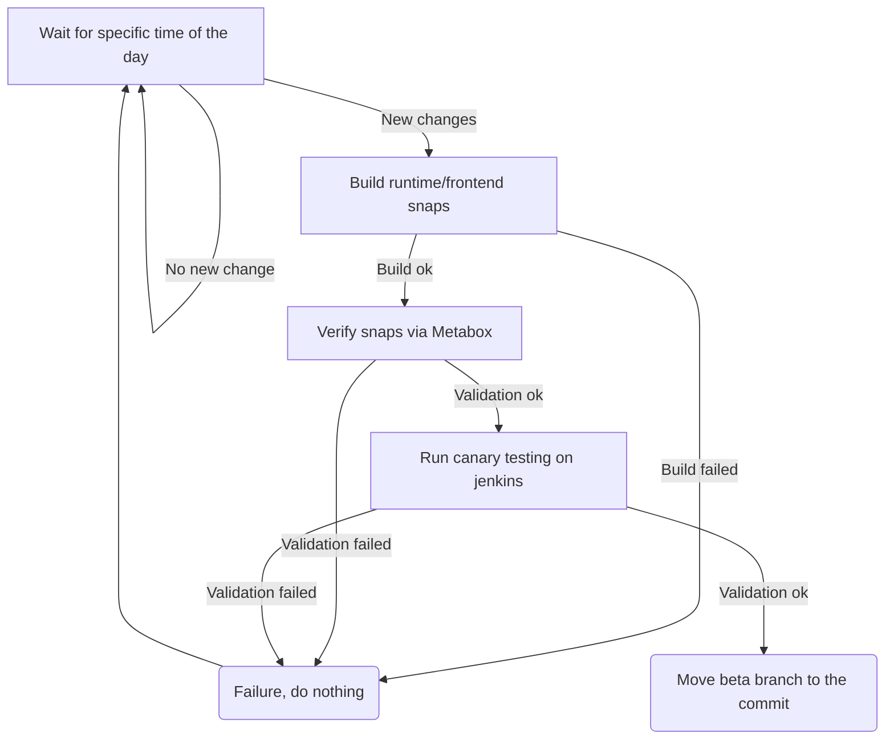

# Checkbox release process

> **_NOTE:_** Here you can check the [Launchpad Builders status]. Our build
process relies on Launchpad builders, and they may be down or very busy. This
might prevent building the packages and snaps from being built.

## When can you relase a new beta version

A new beta version will be automatically released by the canary validation
process. When this process passes, it moves the `beta` branch to the latest
commit it verified calculating it from the version string. Namely if the latest
edge version is `1.2.3-dev120`, and it is verified, the beta `HEAD`
will be moved to the `120th` commit after the tag `v1.2.3` (so that
`origin/beta/HEAD~120` is `v1.2.3`)

The verification process works as follows:



> **_NOTE:_** This process is fully automated, you don't need to trigger it.

## Promote the previous beta release to stable

Internal teams (mostly QA and Certification) are using the version in the beta
snap channels or the beta PPA to complete their tests. If this version is
validated, it can then be pushed to stable for other teams and external
stakeholders.

Therefore, if there has been no negative feedback from internal teams after a
cycle of testing the beta release, run the [Stable release workflow] to copy deb
packages to the stable PPA and promote all snaps to stable.

## How packages versions are generated?

Both Debian packages and checkbox snaps rely on [get\_version.py] to calculate
package versions from git metadata.

```python
>>> from get_version import get_version, OutputFormat
>>> get_version(dev_suffix=True, output_format=OutputFormat.SNAP)
'2.9.0-dev38
```

The get\_version module can generate the version for any packaging we support
and can also be called from the CLI. The idea is that each commit done since
the last tag is categorized using the postfix included in the commit message
and the version is calculated as follows:
- **Infra:** are changes to our CI/CD infrastructure, they are ignored
- **Bugfix:** are bugfixes, the patch number is incremented
- **New:** are new backward compatible features, the minor version is incremented
- **Breaking:** are new breaking changes, the major version number is incremented

> **_NOTE:_** If any commit is in a different format, the script will complain
> about it by logging it to the stderr. Don't ignore these messages: double check
> what was changed in the problematic commits and re-calculate the version
> accordingly

## Tag the release

First you need to determine the version string for the tag.
You can use the previously described script to do so:

- Clone the repository and get the version
  ```bash
  $ git clone git@github.com:canonical/checkbox.git
  $ cd checkbox/tools/release
  $ ./get_version.py --output-format tag
  ```
- Tag the release
  ```
  $ git tag -s "v2.10.0" -m "Beta promotion of: 2.9.1 → 2.10.0"
  ```
- Push the tag to origin
  ```
  $ git push --tags
  ```

## Monitor the build and publish workflows

3 workflows are triggered on tag push events:

- [checkbox deb packages] *(copy packages to the stable PPA)*
- [checkbox snap packages] *(copy snaps to the stable channels)*
- [checkbox core snap packages] *(copy snaps to the stable channels)*

In addition to the above workflows, a [Draft Release Note] is created on Github
with an auto-generated changelog.

Check the related Github Action logs to see if everything runs as expected:

- Snapcraft is not blocked during the snap build process. For example, in this
[build], the i386 build was blocked on an error (`Chroot problem`) for hours
before finally completing

## Send the release e-mail

The release process should have created a new [Draft Release Note]. You can
use this to prepare a release e-mail:

- If this release comes with big changes for the user, you can talk about
them in a *Highlights* section.
- Not all changes in the Release Note from GitHub are meaningful for the
end users. Highlight the ones that are most important for them by bolding
them. For instance, changes related to the tooling used for Checkbox releases
is not important to the users, but fixes for bugs reported by the users are!

You can see a sample release e-mail [here][1].

Send the release e-mail to:

- checkbox-devel@lists.ubuntu.com (public, see [mailing list page])
- ce-certification-qa@lists.canonical.com (private)

**_Note:_** You need to be registered to both these mailing lists in order to
be able to send an e-mail to them.


# References

## PPA/Repositories

* [stable]\: For external customers.
* [beta]\: For Canonical internal users. This version should be the one used for Certification, and early QA pipelines.
* [edge]\: To test recent developments that are not yet in beta.

## Projects released as Debian packages

* [checkbox-ng](https://github.com/canonical/checkbox/tree/main/checkbox-ng)
* [checkbox-support](https://github.com/canonical/checkbox/tree/main/checkbox-support)
* [providers/base](https://github.com/canonical/checkbox/tree/main/providers/base)
* [providers/resource](https://github.com/canonical/checkbox/tree/main/providers/resource)
* [providers/certification-client](https://github.com/canonical/checkbox/tree/main/providers/certification-client)
* [providers/certification-server](https://github.com/canonical/checkbox/tree/main/providers/certification-server)
* [providers/sru](https://github.com/canonical/checkbox/tree/main/providers/sru)
* [providers/tpm2](https://github.com/canonical/checkbox/tree/main/providers/tpm2)
* [providers/gpgpu](https://github.com/canonical/checkbox/tree/main/providers/gpgpu)

[^1]:https://docs.github.com/en/actions/security-guides/automatic-token-authentication#using-the-github_token-in-a-workflow

[setuptools_scm]: https://github.com/pypa/setuptools_scm/
[Stable release workflow]: https://github.com/canonical/checkbox/actions/workflows/checkbox-stable-release.yml
[Bumpversion]: https://github.com/c4urself/bump2version
[stable]: https://launchpad.net/~checkbox-dev/+archive/ubuntu/stable
[beta]: https://code.launchpad.net/~checkbox-dev/+archive/ubuntu/beta
[edge]: https://code.launchpad.net/~checkbox-dev/+archive/ubuntu/edge
[Launchpad Builders status]: https://launchpad.net/builders
[checkbox deb packages]: https://github.com/canonical/checkbox/actions/workflows/deb-beta-release.yml
[checkbox snap packages]: https://github.com/canonical/checkbox/actions/workflows/checkbox-snap-beta-release.yml
[checkbox core snap packages]: https://github.com/canonical/checkbox/actions/workflows/checkbox-core-snap-beta-release.yml
[build]: https://github.com/canonical/checkbox/actions/runs/4371649401/jobs/7649877336
[Draft Release Note]: https://github.com/canonical/checkbox/releases
[mailing list page]: https://lists.ubuntu.com/mailman/listinfo/Checkbox-devel
[semantic versioning]: https://semver.org

[1]: https://lists.ubuntu.com/archives/checkbox-devel/2023-August/000508.html


# Usage

## Testing release tools

These are the steps to run the tests for the release tools:

```bash
# Only run the tests
python -m pytest
# Run the tests and get the coverage
python -m coverage run -m pytest
python -m coverage html
```
If you have `tox` instaled, you can just run

```bash
tox -e py310
``````
