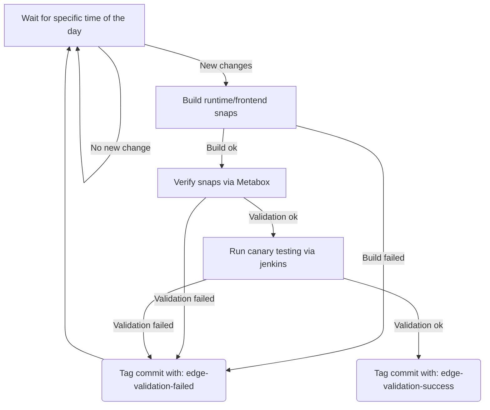

# Checkbox release process

> **_NOTE:_** Check the [Launchpad Builders status] before triggering a release.
Sometimes, the builders will be down and this might prevent building the
packages.

## When can you relase a new beta candidate

You can release a new beta candidate when you have at least one commit tagged
by the verification process. This process will add a tag to the latest commit
it can fetch with the version that is being verified and a
`edge-validation-success` suffix. Note, any commit with that suffix is in theory
a valid candidate for promotion but please, if any more recent commit is marked
as `edge-validation-failed` investigate why, we may have upgraded the testing
infra from one commit to the other!

The verification process works as follows:



> **_NOTE:_** This process is fully automated, you don't need to trigger it.

If you want to verify the status of the latest edge build, run:
```bash
$ git fetch --tags
$ git describe --tags --match "*edge-validation*" origin/main &&
    git log -1 $(
        git describe --tags --match "*edge-validation*" --abbrev=0 origin/main)
```

These commands will show you the latest tag that is in the repo and the commit
it is associated with. If this tag ends with `edge-validation-success` you can
proceed with the release.

## Promote the previous beta release to stable

Internal teams (mostly QA and Certification) are using the version in the beta
snap channels or the Testing PPA to complete their tests. If this version is
validated, it can then be pushed to stable for other teams and external
stakeholders.

Therefore, if there has been no negative feedback from internal teams after a
cycle of testing the beta release, run the [Stable release workflow] to copy deb
packages to the stable PPA and promote all snaps to stable.

Then, it's time to build the new beta version.

## Tag the release

First you need to understand what tag to push. Checkbox uses
[semantic versioning], in order to calculate what version number you should
push, you need to see what you are actually releasing.

Run the following commands to get a list of changes since the last stable
release:

```bash
$ git fetch --tags
$ git describe --tags --match "*[0123456789]" origin/main &&
    git log $(
        git describe --tags --match "*[0123456789]" --abbrev=0 origin/main
    )..origin/main
```

If the list includes:
- Only bugfixes: you can use the version tag that was calculated by the
`edge-verification` job (increment patch).
- New, backward compatible features: you have to increment the minor version
- Non-backward compatible changes: you have to increment the major version

All commit messages in the main history should have a postfix indicating what
kind of change they are:
- **Infra:** are changes to our testing infrastructure, you can safely ignore
them
- **Bugfix:** are bugfixes, increment patch version
- **New:** are new backward compatible features, increment minor version
- **Breaking:** are new breaking changes, increment major version

If you were to be at at the tag `v2.9.1-edge-validation-success` and you
had to release a new version with at least one backward compatible new feature,
run the following commands:

- Clone the repository
  ```
  $ git clone git@github.com:canonical/checkbox.git
  ```
- Tag the release
  ```
  $ git tag -s "v2.10.0" -m "Beta promotion of: 2.9.1 → 2.10.0"
  ```
- Push the tag to origin
  ```
  $ git push --tags
  ```

## How packages versions are generated?

Both Debian packages and checkbox snaps rely on [setuptools_scm] to extract
package versions from git metadata.

```
>>> from setuptools_scm import get_version
>>> get_version()
'2.9.dev38+g896ae8978
```

In general, when the HEAD of a branch is tagged, the version is going to be
the tag. If a branch's HEAD is not tagged, the version is going to be the latest
tag with the patch number incremented by 1, a postfix that encodes the distance
from the tag itself (in the form of `dev{N}` where `N` is the number of
commits since the latest tag) and the hash of the current HEAD.

> **_NOTE_**: If you have some uncommitted changes your version might also have
a date postfix in the form of `.YYYYMMDD`, this should never happen in a release!

## Monitor the build and publish workflows

3 workflows are triggered on tag push events:

- [checkbox deb packages] *(built and published to the testing PPA)*
- [checkbox snap packages] *(built and uploaded to their respective beta
  channels)*
- [checkbox core snap packages] *(built and uploaded to their respective beta
  channels)*

In addition to the above workflows, a [Draft Release Note] is created on Github
with an auto-generated changelog.

Check the related Github Action logs to see if everything runs as expected:

- Snapcraft is not blocked during the snap build process. For example, in this
[build], the i386 build was blocked on an error (`Chroot problem`) for hours
before finally completing
- the expected number of snaps are built. Snapcraft does not return 1 when only
a few of the snaps are built, which leads to Github Actions being marked as
successful even though some snaps are not built (and therefore not pushed to
the store)

## Send the release e-mail

The release process should have created a new [Draft Release Note]. You can
use this to prepare a release e-mail:

- If this release comes with big changes for the user, you can talk about
them in a *Highlights* section.
- Not all changes in the Release Note from GitHub are meaningful for the
end users. Highlight the ones that are most important for them by bolding
them. For instance, changes related to the tooling used for Checkbox releases
is not important to the users, but fixes for bugs reported by the users are!

You can see a sample release e-mail [here][1].

Send the release e-mail to:

- checkbox-devel@lists.ubuntu.com (public, see [mailing list page])
- ce-certification-qa@lists.canonical.com (private)

**_Note:_** You need to be registered to both these mailing lists in order to
be able to send an e-mail to them.

# References

## PPA/Repositories

* [Stable]\: The official release of Checkbox
* [Testing]\: Release candidates of Checkbox before it becomes the official
release
* [Development]\: Daily builds (that may contain experimental features)

## Projects released as Debian packages

* [checkbox-ng](https://github.com/canonical/checkbox/tree/main/checkbox-ng)
* [checkbox-support](https://github.com/canonical/checkbox/tree/main/checkbox-support)
* [providers/base](https://github.com/canonical/checkbox/tree/main/providers/base)
* [providers/resource](https://github.com/canonical/checkbox/tree/main/providers/resource)
* [providers/certification-client](https://github.com/canonical/checkbox/tree/main/providers/certification-client)
* [providers/certification-server](https://github.com/canonical/checkbox/tree/main/providers/certification-server)
* [providers/sru](https://github.com/canonical/checkbox/tree/main/providers/sru)
* [providers/tpm2](https://github.com/canonical/checkbox/tree/main/providers/tpm2)
* [providers/gpgpu](https://github.com/canonical/checkbox/tree/main/providers/gpgpu)

[^1]:https://docs.github.com/en/actions/security-guides/automatic-token-authentication#using-the-github_token-in-a-workflow

[setuptools_scm]: https://github.com/pypa/setuptools_scm/
[Stable release workflow]: https://github.com/canonical/checkbox/actions/workflows/checkbox-stable-release.yml
[Bumpversion]: https://github.com/c4urself/bump2version
[Stable]: https://launchpad.net/~hardware-certification/+archive/ubuntu/public
[Testing]: https://code.launchpad.net/~checkbox-dev/+archive/ubuntu/testing
[Development]: https://code.launchpad.net/~checkbox-dev/+archive/ubuntu/ppa
[Launchpad Builders status]: https://launchpad.net/builders
[checkbox deb packages]: https://github.com/canonical/checkbox/actions/workflows/deb-beta-release.yml
[checkbox snap packages]: https://github.com/canonical/checkbox/actions/workflows/checkbox-snap-beta-release.yml
[checkbox core snap packages]: https://github.com/canonical/checkbox/actions/workflows/checkbox-core-snap-beta-release.yml
[build]: https://github.com/canonical/checkbox/actions/runs/4371649401/jobs/7649877336
[Draft Release Note]: https://github.com/canonical/checkbox/releases
[mailing list page]: https://lists.ubuntu.com/mailman/listinfo/Checkbox-devel
[semantic versioning]: https://semver.org

[1]: https://lists.ubuntu.com/archives/checkbox-devel/2023-August/000508.html
